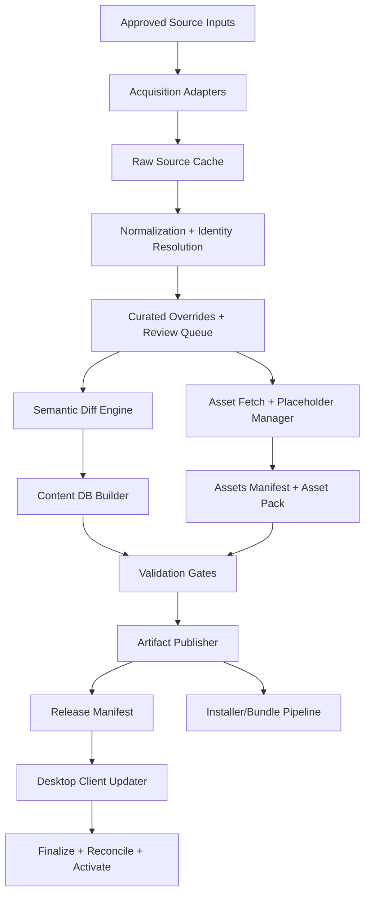

# 1. Executive Recommendation

- Adopt a **two-system architecture** with a strict boundary:
  - **Maintainer-side content production pipeline**: acquires approved source data, normalizes it, reconciles assets, computes diffs, builds validated artifacts, and publishes immutable releases.
  - **Desktop client update consumer**: downloads only maintainer-published artifacts, validates them, stages them, swaps them into place, reconciles user state, and activates them safely.
- Keep the desktop client **out of the business of scraping Fandom or pulling BBB media directly**. That boundary is already implied by [C:\MSM_App\MSM_Awakening_Tracker_Vision.md](C:\MSM_App\MSM_Awakening_Tracker_Vision.md), [C:\MSM_App\MSM_Awakening_Tracker_SRS_v1.1.md](C:\MSM_App\MSM_Awakening_Tracker_SRS_v1.1.md), and the current implementation in [C:\MSM_App\app\updater\update_service.py](C:\MSM_App\app\updater\update_service.py).
- Recommended artifact contract:
  - **Required**: `manifest.json` + `content.db`
  - **Recommended next evolution**: optional `assets-pack.zip` + `assets-manifest.json`, capability-gated so current client behavior remains compatible while future clients can consume runtime media updates through the existing cache-first resolver in [C:\MSM_App\app\assets\resolver.py](C:\MSM_App\app\assets\resolver.py).
- Biggest architectural risks:
  - **Current content identity is unstable across rebuilds** because `userstate.db` stores `monster_id` / `egg_type_id` integers, while the build pipeline currently recreates `content.db` from literal lists in [C:\MSM_App\scripts\seed_content_db.py](C:\MSM_App\scripts\seed_content_db.py). Any reordering or insertion can silently remap IDs.
  - **Docs describe a broader scrape/fetch pipeline than the shipped client actually implements**. The plan must explicitly classify scraper/fetcher logic as maintainer-only.
  - **Media remains product-critical** because [C:\MSM_App\UI_Evaluation_Feedback_Round2.md](C:\MSM_App\UI_Evaluation_Feedback_Round2.md) identifies placeholder-heavy imagery as a major blocker to UI fidelity.
- Why this boundary split is right:
  - It honors the SRS/vision contract that the client performs **prebuilt content DB replacement** only.
  - It keeps legal/media-source risk and scraping complexity out of the end-user binary.
  - It lets the project add new monsters, updated requirements, and improved imagery without turning the desktop client into a network crawler.

# 2. Current-State Assessment

## What the repo already has

- A working desktop client-side updater in [C:\MSM_App\app\updater\update_service.py](C:\MSM_App\app\updater\update_service.py):
  - fetch manifest
  - compare `content_version`
  - download staged `content.db`
  - validate staged DB
  - atomically replace local `content.db`
  - reopen connections and reconcile state
- Minimal content DB validation in [C:\MSM_App\app\updater\validator.py](C:\MSM_App\app\updater\validator.py): required tables, minimum metadata keys, non-empty core tables, and orphan checks.
- Post-update activation/reconciliation in [C:\MSM_App\app\ui\main_window.py](C:\MSM_App\app\ui\main_window.py): service rebind, deprecated-target cleanup, progress clipping, UI refresh, undo/redo reset.
- A Settings screen already exposing update state and content metadata in [C:\MSM_App\app\ui\settings_panel.py](C:\MSM_App\app\ui\settings_panel.py).
- A seeded content DB build path in [C:\MSM_App\scripts\seed_content_db.py](C:\MSM_App\scripts\seed_content_db.py) and placeholder/media bundle generation in [C:\MSM_App\scripts\generate_assets.py](C:\MSM_App\scripts\generate_assets.py).
- A bundle verifier in [C:\MSM_App\scripts\verify_bundle.py](C:\MSM_App\scripts\verify_bundle.py).
- A simple content schema in [C:\MSM_App\app\db\migrations\content\0001_initial_schema.sql](C:\MSM_App\app\db\migrations\content\0001_initial_schema.sql): `monsters`, `egg_types`, `monster_requirements`, `update_metadata`.
- A cache-first asset resolver in [C:\MSM_App\app\assets\resolver.py](C:\MSM_App\app\assets\resolver.py) that already supports a future downloaded-asset cache under `data_dir/assets`.

## What is missing

- No maintainer-side acquisition pipeline exists in the repo today. There is no implemented `scraper.py`, `asset_fetcher.py`, normalization layer, review workflow, diff engine, or release publisher.
- Current seed data is **hardcoded Python literals** in [C:\MSM_App\scripts\seed_content_db.py](C:\MSM_App\scripts\seed_content_db.py), not a reviewable canonical content source.
- No canonical intermediate representation exists for provenance, source hashes, alias mapping, review overrides, asset status, or diff auditing.
- No artifact signing, manifest integrity verification, release channeling, or reproducible-build metadata exists.
- No schema support exists for stable content identity beyond runtime integer IDs and `wiki_slug`.
- No safe rename/deprecation/slug-drift model exists outside of `monsters.is_deprecated`.
- `egg_types` have no deprecation field even though the TDD conceptually treats eggs as deprecatable.
- The client validator does not verify `PRAGMA integrity_check` output, asset existence, manifest checksums, or schema version compatibility.

## Architectural mismatches / doc-code divergence

- [C:\MSM_App\MSM_Awakening_Tracker_SRS_v1.1.md](C:\MSM_App\MSM_Awakening_Tracker_SRS_v1.1.md) FR-703 and the vision doc describe a **client that downloads a prebuilt `content.db`**. However [C:\MSM_App\MSM_Awakening_Tracker_TDD_v1_3.md](C:\MSM_App\MSM_Awakening_Tracker_TDD_v1_3.md) also describes scraper/fetcher modules and sections that read like runtime update behavior. This plan resolves that by classifying scrape/fetch as **maintainer-only**.
- The SRS mentions tracked settings `db_version` / `db_last_updated`, while the implemented app reads these from `content.db/update_metadata` through [C:\MSM_App\app\services\app_service.py](C:\MSM_App\app\services\app_service.py).
- The TDD conceptually says deprecations apply to monsters and eggs, but the current schema only supports `monsters.is_deprecated`.
- The current repo stores monster and egg image paths, but UI round-2 feedback shows imagery quality is still product-critical. Therefore image pipeline work cannot be deferred indefinitely behind “DB-only” thinking.
- Most importantly: `**userstate.db` persists numeric monster and egg IDs** in [C:\MSM_App\app\db\migrations\userstate\0001_initial_schema.sql](C:\MSM_App\app\db\migrations\userstate\0001_initial_schema.sql), while the content DB is rebuilt from scratch by [C:\MSM_App\scripts\seed_content_db.py](C:\MSM_App\scripts\seed_content_db.py). This is the biggest hidden correctness risk in the current architecture.

# 3. Target Architecture

## Component breakdown

## Maintainer pipeline responsibilities

- Read authoritative source data from approved external and curated internal sources.
- Discover candidate new monsters and changed requirements.
- Normalize all source material into a canonical model.
- Resolve identity, aliases, deprecations, and slug/name drift.
- Fetch or map approved images.
- Assign placeholders where official assets are unavailable.
- Build `content.db` deterministically.
- Produce release artifacts, hashes, validation reports, and publish metadata.
- Never run inside the shipped desktop app.

## Desktop client responsibilities

- Fetch remote release manifest.
- Validate client compatibility and artifact metadata.
- Download staged artifacts.
- Validate staged payload.
- Replace local content safely.
- Rebind, reconcile, and refresh state/UI.
- Use the existing cache-first asset resolver for downloaded assets when asset-pack support is enabled.
- Never contact Fandom or BBB directly for domain content.

## Publish/distribution layer responsibilities

- Host immutable release artifacts.
- Serve a channel-specific manifest (`stable`, optionally `beta`).
- Publish checksums/signatures.
- Preserve old artifacts for rollback and audit.
- Provide release metadata for CI and desktop-client compatibility checks.

## Approved source inputs

- **Factual content source**: MSM wiki / Fandom MediaWiki pages for monster roster discovery, breeding times, and requirement sets. This is a maintainer-pipeline source only.
- **Official asset source**: BBB Fan Kit only. No fan wiki images, no third-party host scraping, no opportunistic URL grabs.
- **Curator-owned overrides**:
  - identity aliases
  - canonical type classification
  - source URL/slug overrides
  - deprecation decisions
  - placeholder approvals
  - asset override mappings when Fan Kit filenames do not match source naming
- **Fallback assets**: generated placeholders produced by pipeline tooling and explicitly flagged as placeholders.

## Provenance tracking model

- Every normalized monster and egg record must retain:
  - authoritative source type
  - source URL or slug
  - source retrieval timestamp
  - source payload fingerprint/hash
  - whether values are raw-source derived or curator-overridden
- Every asset record must retain:
  - source type (`bbb_fan_kit`, `generated_placeholder`)
  - acquisition timestamp
  - binary SHA-256
  - license/compliance status
  - placeholder status

# 4. Data Model / Schema Plan

## Current schema assessment

- Current shipped schema in [C:\MSM_App\app\db\migrations\content\0001_initial_schema.sql](C:\MSM_App\app\db\migrations\content\0001_initial_schema.sql) is sufficient for a seed DB but not for a robust content pipeline.
- Current strengths:
  - `wiki_slug` exists for monsters
  - `is_placeholder` exists for monsters and eggs
  - `is_deprecated` exists for monsters
  - `update_metadata` exists
- Current weaknesses:
  - no stable content keys independent of numeric row IDs
  - no egg deprecation support
  - no source fingerprint fields
  - no asset hash/state fields
  - no build/release metadata beyond key/value `update_metadata`
  - no alias/rename history

## Required schema changes in `content.db`

- Add a **stable key** for both monsters and eggs.
  - `monsters.content_key TEXT NOT NULL UNIQUE`
  - `egg_types.content_key TEXT NOT NULL UNIQUE`
  - This key is maintainer-owned and must not change across renames, slug drift, or row reordering.
  - It becomes the canonical identity anchor for diffing and for client reconciliation.
- Add egg deprecation support.
  - `egg_types.is_deprecated INTEGER NOT NULL DEFAULT 0 CHECK(is_deprecated IN (0,1))`
  - This aligns the actual schema with the deprecation story in the TDD.
- Add source/provenance fields.
  - `monsters.source_slug TEXT NOT NULL DEFAULT ''`
  - `monsters.source_fingerprint TEXT NOT NULL DEFAULT ''`
  - `monsters.source_last_seen_utc TEXT NOT NULL DEFAULT ''`
  - `egg_types.source_slug TEXT NOT NULL DEFAULT ''`
  - `egg_types.source_fingerprint TEXT NOT NULL DEFAULT ''`
  - `egg_types.source_last_seen_utc TEXT NOT NULL DEFAULT ''`
- Add asset metadata fields.
  - `monsters.asset_sha256 TEXT NOT NULL DEFAULT ''`
  - `monsters.asset_source TEXT NOT NULL DEFAULT ''`
  - `monsters.asset_status TEXT NOT NULL DEFAULT 'missing'`
  - `egg_types.asset_sha256 TEXT NOT NULL DEFAULT ''`
  - `egg_types.asset_source TEXT NOT NULL DEFAULT ''`
  - `egg_types.asset_status TEXT NOT NULL DEFAULT 'missing'`
- Add deprecation metadata.
  - `monsters.deprecated_at_utc TEXT NOT NULL DEFAULT ''`
  - `monsters.deprecation_reason TEXT NOT NULL DEFAULT ''`
  - `egg_types.deprecated_at_utc TEXT NOT NULL DEFAULT ''`
  - `egg_types.deprecation_reason TEXT NOT NULL DEFAULT ''`
- Extend `update_metadata` into a true content-release metadata channel. Required keys should become:
  - `content_version`
  - `schema_version`
  - `published_at_utc`
  - `last_updated_utc`
  - `source`
  - `build_id`
  - `build_git_sha`
  - `asset_manifest_sha256`
  - `artifact_contract_version`

## Recommended new auxiliary tables in `content.db`

- `content_aliases`
  - purpose: preserve old names/slugs for human audit and future migrations
  - columns: `entity_type`, `content_key`, `alias_kind`, `alias_value`, `is_active`
- `content_audit`
  - purpose: store build-level audit metadata, generator version, and source snapshot IDs
  - columns: `build_id`, `input_manifest_sha256`, `raw_snapshot_sha256`, `generated_at_utc`

## Required schema changes in `userstate.db`

- This is mandatory for safe long-term content updates.
- Add stable-key fields so userstate can survive rebuilt `content.db` artifacts even if numeric row IDs shift:
  - `active_targets.monster_key TEXT NOT NULL DEFAULT ''`
  - `target_requirement_progress.egg_key TEXT NOT NULL DEFAULT ''`
- Migration/backfill plan:
  - on upgrade, derive `monster_key` and `egg_key` from the currently installed `content.db` using existing integer IDs
  - once populated, all post-update reconciliation should resolve current integer IDs from stable keys, not assume IDs remain constant forever
- Keep integer IDs for runtime joins/performance, but treat stable keys as the durable cross-release identity.

## Canonical intermediate representation

- Do **not** use raw scraped output or hand-edited Python tuples as the canonical source.
- Recommended maintainer-side IR layers:
  - `pipeline/raw/`:
    - raw wiki responses
    - raw BBB asset inventory snapshots
    - timestamped and hashed
  - `pipeline/normalized/`:
    - `monsters.json`
    - `egg_types.json`
    - `requirements.json`
    - `assets.json`
  - `pipeline/curation/`:
    - `identity_overrides.yaml`
    - `asset_overrides.yaml`
    - `deprecations.yaml`
    - `manual_review_queue.yaml`
  - `pipeline/build/`:
    - staging SQLite
    - diff report
    - validation report
    - artifact manifest
- Each normalized record must contain:
  - `content_key`
  - display name
  - type
  - source slug/url
  - source fingerprint
  - asset path
  - asset status
  - placeholder flag
  - deprecation flag
  - last seen timestamp

# 5. Asset / Image Pipeline Plan

## Official asset sourcing

- Approved distributable assets must come from BBB Fan Kit only.
- The pipeline must include a dedicated **BBB asset ingestion step** with domain restrictions and deterministic mapping.
- Recommended acquisition approach:
  - prefer downloading the canonical Fan Kit archive once per build cycle if BBB distributes a zip
  - otherwise ingest from a maintainer-curated allowlisted source map
- Never allow the desktop client to discover asset URLs dynamically from the wiki.

## Placeholder policy

- Placeholder generation is a **maintainer-pipeline responsibility**, not a client responsibility.
- Placeholder rules:
  - if a new monster is discovered and no approved BBB art exists, generate a placeholder immediately
  - mark `is_placeholder = 1`
  - set `asset_source = generated_placeholder`
  - compute and store `asset_sha256`
  - include placeholder asset in the build artifact so clients never get broken paths
- Placeholder quality standard should be raised because [C:\MSM_App\UI_Evaluation_Feedback_Round2.md](C:\MSM_App\UI_Evaluation_Feedback_Round2.md) shows placeholder-heavy imagery materially harms product fidelity.
- Recommended placeholder taxonomy:
  - monster placeholder card
  - egg placeholder icon
  - type-specific color/emblem variants
  - versioned placeholder generator so visual improvements can roll out systematically

## Asset verification

- Extend [C:\MSM_App\scripts\verify_bundle.py](C:\MSM_App\scripts\verify_bundle.py) into a release-grade asset verifier that checks:
  - every `image_path` and `egg_image_path` exists in the artifact set
  - every asset hash matches `assets-manifest.json`
  - placeholder assets are explicitly declared as placeholders
  - no asset path resolves outside the allowed resource root
  - every non-placeholder asset has `asset_source = bbb_fan_kit`
- Reuse [C:\MSM_App\app\assets\resolver.py](C:\MSM_App\app\assets\resolver.py) cache-first model as the runtime target for optional downloaded asset packs.

## UI polish readiness implication

- Real imagery is not cosmetic-only; it is a product readiness issue.
- The asset pipeline must be considered part of release quality because the current UI review says Catalog cannot feel final while placeholder-heavy.
- Therefore, asset pack production must be in Phase 2, not deferred to an undefined future.

# 6. Diff / Compare / Reconciliation Strategy

## Comparison model

- Use a **semantic diff**, not a pure row-level SQLite diff.
- Compare on normalized entities keyed by stable `content_key`, not numeric row IDs.
- Diff dimensions:
  - entity existence (`new`, `existing`, `deprecated`, `revived`)
  - core fields (`name`, `type`, `wiki_slug`, times, statuses)
  - requirement set
  - asset identity/hash/status
  - deprecation metadata

## Exact decision logic

### Monster identity resolution

- Resolution order:
  1. explicit maintainer override map (`content_key` ↔ source slug/name)
  2. exact match on existing `content_key`
  3. exact match on current `wiki_slug`
  4. exact match on normalized name within same monster type
  5. alias table lookup
  6. heuristic candidate match → manual review queue
  7. otherwise classify as `new_monster_candidate`
- Do **not** auto-resolve a rename based solely on fuzzy name similarity.
- If slug changes but `content_key` override or alias says same entity, classify as `slug_drift`, not `new`.

### Egg identity resolution

- Same pattern as monsters, but simpler because egg types are generally more stable.
- Use `content_key` and alias map first; name-only match second.

### Requirement diff model

- Normalize each monster’s requirement set as sorted tuples of `(egg_content_key, quantity)`.
- Compare previous vs incoming requirement sets as sets/maps.
- Classifications:
  - `requirement_added`
  - `requirement_removed`
  - `quantity_changed`
  - `egg_reference_changed`
- A monster is `changed_requirement` if any element of the normalized requirement map differs.

### Asset diff model

- Compare `asset_path`, `asset_sha256`, `asset_source`, `is_placeholder`, and `asset_status`.
- Classifications:
  - `asset_added`
  - `asset_removed`
  - `asset_changed`
  - `placeholder_to_official`
  - `official_to_placeholder` (should fail build unless explicitly approved)

### Deprecation logic

- If an entity disappears from authoritative source input:
  - do not hard-delete from canonical content
  - mark `is_deprecated = 1`
  - record `deprecated_at_utc`
  - add deprecation reason
- If a deprecated monster reappears later, preserve the same `content_key` and mark as active again.

### Rename logic

- A rename is only accepted when:
  - source identity is stable through `content_key` or approved alias mapping
  - type is unchanged or explicitly approved
  - requirements are plausibly continuous
- Otherwise create a manual review item.

## Reconciliation strategy in the desktop app

- Current post-update reconciliation in [C:\MSM_App\app\ui\main_window.py](C:\MSM_App\app\ui\main_window.py) clips progress and removes deprecated targets by numeric `monster_id`. That logic should be preserved conceptually but reworked to use stable keys.
- New reconcile flow:
  - resolve `monster_key` and `egg_key` to current content rows
  - if monster exists but is deprecated, remove target and progress
  - if monster exists and active, refresh target requirement rows from the new requirement set
  - clip `satisfied_count` when updated `required_count` is lower
  - if an egg is deprecated and no longer referenced by any active requirement set, allow it to disappear naturally from visible derived rows

# 7. Artifact Packaging and Manifest Contract

## What gets published

- Mandatory artifacts for every content release:
  - `content.db`
  - `manifest.json`
  - `content.db.sha256`
  - `validation-report.json`
  - `diff-report.json`
- Recommended artifacts for media-capable releases:
  - `assets-pack.zip`
  - `assets-manifest.json`
  - `assets-pack.sha256`
- Recommended installer-channel artifacts:
  - full resource bundle snapshot for packaging jobs

## Manifest shape

- Current client-compatible required fields:
  - `content_version`
  - `content_db_url`
- Recommended extended manifest fields:
  - `artifact_contract_version`
  - `channel`
  - `published_at_utc`
  - `schema_version`
  - `min_supported_client_version`
  - `content_db_sha256`
  - `content_db_size_bytes`
  - `content_db_url`
  - `content_db_required` = true
  - `assets_pack_url` (optional)
  - `assets_pack_sha256` (optional)
  - `assets_pack_size_bytes` (optional)
  - `assets_pack_optional` = true/false
  - `release_notes_url` (optional)
  - `diff_summary`
  - `rollback_to_version`
- Client behavior rules:
  - unknown fields must be ignored safely
  - missing required fields fail update check
  - incompatible `artifact_contract_version` or `min_supported_client_version` fails early

## Versioning format

- Keep `content_version` human-readable and monotonic.
- Recommended format: `YYYY.MM.DD.N` or semver-like content releases, but choose one and enforce consistently.
- Also record immutable `build_id` and `build_git_sha` in `update_metadata` and release artifacts.

## Checksum/signature expectations

- Minimum: SHA-256 for every published artifact.
- Recommended: detached signature for `manifest.json` and artifact checksums if a signing key is available.
- Desktop client Phase 3 should at least validate checksum; signature verification can be feature-gated if key distribution is not ready.

## Backward compatibility model

- Near-term: keep the manifest backward-compatible with the current client by preserving `content_version` and `content_db_url`.
- Medium-term: add optional asset-pack fields that older clients ignore.
- Only introduce breaking artifact contract changes behind a new `artifact_contract_version` and minimum client version gate.

# 8. Desktop Client Integration Plan

## What stays

- Keep [C:\MSM_App\app\updater\update_service.py](C:\MSM_App\app\updater\update_service.py) as the core staging/finalization engine.
- Keep [C:\MSM_App\app\ui\main_window.py](C:\MSM_App\app\ui\main_window.py) as the owner of post-update finalization, rebind, reconciliation, and UI refresh.
- Keep [C:\MSM_App\app\updater\validator.py](C:\MSM_App\app\updater\validator.py) as the entry point for client-side artifact validation.
- Keep [C:\MSM_App\app\assets\resolver.py](C:\MSM_App\app\assets\resolver.py) as the runtime asset resolution abstraction.

## What must change

- Refactor `UpdateService` to remove fragile check/apply coupling.
  - `apply_update()` must either re-fetch the manifest or consume an explicitly persisted checked manifest payload.
  - It must not silently no-op when `_worker` is absent.
- Expand validator scope.
  - read and assert `PRAGMA integrity_check == 'ok'`
  - validate required metadata keys including future `schema_version` and `artifact_contract_version`
  - validate schema version compatibility against the running client
  - validate checksum of downloaded `content.db`
  - validate egg-side orphan references as well as monster-side references
- Add capability-gated asset-pack support.
  - if manifest includes `assets_pack_url` and client capability is enabled, download/stage/unpack into `data_dir/assets`
  - verify every unpacked asset hash against `assets-manifest.json`
  - atomically swap asset cache generation just like DB staging
- Refactor post-update reconciliation to use stable keys, not only numeric IDs.
- Add startup crash-recovery check using `last_reconciled_content_version` in `userstate.db` as described in the TDD and currently missing from the actual schema.

## Safety / rollback implications

- DB replacement and asset-cache replacement must be staged independently and committed atomically as one logical release activation.
- Recommended runtime staging structure:
  - `content_staging.db`
  - `assets_staging/`
  - `content_backup.db`
  - `assets_backup/`
- Rollback path must restore both DB and asset cache together when both are part of a release.
- `cleanup_staging_files()` should remain, but only run after a complete successful activation.

## Why client should eventually understand asset payloads

- The current resolver already supports `data_dir/assets`, which is an architectural hint that runtime media overrides were anticipated.
- Keeping the client DB-only forever means improved imagery can only ship through app reinstalls or full installer upgrades, which conflicts with the product goal of staying current with improved imagery over time.
- Therefore the recommended client roadmap is:
  - immediate compatibility: DB-only still works
  - next hardening phase: optional asset-pack consumption via cache

# 9. Validation and Test Strategy

## Test pyramid

- **Unit tests**:
  - source adapters
  - normalizers
  - identity resolver
  - diff engine
  - asset hash calculator
  - manifest builder
  - validator extensions
- **Integration tests**:
  - raw source → normalized IR
  - normalized IR → `content.db`
  - `content.db` + assets → verification
  - client updater with staged manifest and artifact files
- **Golden snapshot tests**:
  - normalized content JSON snapshots
  - diff-report snapshots for known content changes
  - generated `content.db` row counts and key tables for a pinned source snapshot
- **End-to-end tests**:
  - source snapshot → normalized → diff → build → package → publish manifest → client check → stage → finalize → reconcile

## Exact validation gates

- Schema validity
- Required tables/metadata present
- `PRAGMA integrity_check == ok`
- No orphan requirements on either side (`monster_id`, `egg_type_id`)
- No duplicate `content_key`
- No duplicate semantic monsters after identity resolution
- Required monster counts by type are within configured expectations or explicitly waived
- Every non-empty asset path exists in artifact set
- Every asset hash matches manifest
- No `official_to_placeholder` downgrade without explicit override approval
- No requirement references to deprecated eggs unless explicitly allowed for historical rows
- Published artifact checksums valid
- Rebuild reproducibility:
  - running the same normalized input twice produces identical `content.db` schema/content hash and identical asset manifest

## CI checks

- Add a maintainer pipeline workflow that runs:
  1. acquire/normalize
  2. diff
  3. build `content.db`
  4. build assets manifest/pack
  5. validate bundle
  6. run tests
  7. publish only on tagged/promoted release
- Add a “dry-run content diff” workflow for pull requests so maintainers see:
  - proposed new monsters
  - changed requirements
  - deprecations
  - missing official assets
  - placeholder transitions

## Bundle verification evolution

- Evolve [C:\MSM_App\scripts\verify_bundle.py](C:\MSM_App\scripts\verify_bundle.py) from a simple release helper into a reusable validation module shared by CI and release publishing.
- Keep the existing checks as the baseline, but make thresholds/config driven instead of hardcoded in Python literals.

## Failure scenarios to test

- malformed manifest
- checksum mismatch
- schema mismatch
- missing required metadata key
- valid DB but missing asset paths
- renamed monster with unchanged `content_key`
- source slug drift
- deprecated monster with active user targets
- requirement shrink causing progress clipping
- asset-pack download succeeds but unpack hash fails
- finalize succeeds for DB but asset activation fails → full rollback
- interrupted finalization recovered on next startup

# 10. Phased Implementation Roadmap

## Phase 0: decisions/contract alignment

### Objectives

- Freeze the architectural boundary between maintainer pipeline and desktop client.
- Lock the artifact contract and stable-identity strategy before implementation begins.

### Exact tasks

- Write an ADR that states:
  - client never scrapes external content sources
  - maintainer pipeline owns acquisition and asset ingestion
  - `content_key` becomes the durable identity layer
  - manifest evolves additively from current `content_version` + `content_db_url`
- Reconcile SRS/TDD wording so scraper/fetcher logic is explicitly maintainer-only.
- Define approved source list and legal policy in one maintainer-facing design note.
- Define content release channels (`stable` default, optional `beta`).
- Decide whether signatures ship in initial release or checksum-only is acceptable for first rollout.

### Files/modules likely impacted

- [C:\MSM_App\MSM_Awakening_Tracker_SRS_v1.1.md](C:\MSM_App\MSM_Awakening_Tracker_SRS_v1.1.md)
- [C:\MSM_App\MSM_Awakening_Tracker_TDD_v1_3.md](C:\MSM_App\MSM_Awakening_Tracker_TDD_v1_3.md)
- new maintainer docs under repo root or `docs/`

### Dependencies

- None; this is the alignment gate.

### Acceptance criteria

- One agreed architecture document exists.
- Stable identity strategy is explicitly chosen.
- Artifact contract v1.1 is frozen.
- Legal/source policy is unambiguous.

### Major risks

- If Phase 0 is skipped, implementation will recreate the current doc/code ambiguity.

## Phase 1: source acquisition + normalization foundation

### Objectives

- Replace hardcoded Python-literal seeding as the authoring model.
- Establish canonical intermediate data, provenance tracking, and reviewable overrides.

### Exact tasks

- Create maintainer pipeline package structure, e.g. `pipeline/` or `tools/content_pipeline/`.
- Implement raw acquisition adapters for:
  - Fandom factual data snapshots
  - BBB asset inventory
- Implement raw cache persistence with hashes and retrieval timestamps.
- Implement normalized schemas for monsters, eggs, requirements, assets.
- Implement maintainer-owned `content_key` registry and alias/override files.
- Implement a manual review queue for unresolved identity matches and missing asset mappings.
- Backfill current seeded dataset into the new canonical normalized format.
- Add migration plan for `content.db` and `userstate.db` stable-key support.

### Files/modules likely impacted

- new pipeline modules
- [C:\MSM_App\scripts\seed_content_db.py](C:\MSM_App\scripts\seed_content_db.py) (eventually converted to compile from normalized inputs)
- [C:\MSM_App\app\db\migrations\content\0001_initial_schema.sql](C:\MSM_App\app\db\migrations\content\0001_initial_schema.sql) via new migration files
- [C:\MSM_App\app\db\migrations\userstate\0001_initial_schema.sql](C:\MSM_App\app\db\migrations\userstate\0001_initial_schema.sql) via new migration files
- [C:\MSM_App\app\domain\models.py](C:\MSM_App\app\domain\models.py)
- [C:\MSM_App\app\repositories\monster_repo.py](C:\MSM_App\app\repositories\monster_repo.py)

### Dependencies

- Phase 0 contract decisions.

### Acceptance criteria

- Normalized content can represent the full current catalog.
- Every current monster and egg has a stable `content_key`.
- Raw inputs are cached and fingerprinted.
- Unresolved identity or asset mismatches are surfaced as explicit review items, not silently guessed.

### Major risks

- Underestimating identity resolution complexity, especially rename vs new-entity classification.

## Phase 2: diff/build/package pipeline

### Objectives

- Turn normalized content into deterministic release artifacts with validation and audit outputs.

### Exact tasks

- Implement semantic diff engine keyed by `content_key`.
- Generate machine-readable diff reports.
- Build `content.db` deterministically from normalized content and overrides.
- Implement asset acquisition/reconciliation and placeholder generation.
- Produce `assets-manifest.json` and optional `assets-pack.zip`.
- Extend bundle verification to include hashes, provenance, and placeholder policy.
- Generate `manifest.json`, checksums, validation report, and build metadata.
- Publish immutable artifacts to the content release location.

### Files/modules likely impacted

- new pipeline build/diff/publish modules
- [C:\MSM_App\scripts\generate_assets.py](C:\MSM_App\scripts\generate_assets.py) (likely split into reusable asset-builder modules)
- [C:\MSM_App\scripts\verify_bundle.py](C:\MSM_App\scripts\verify_bundle.py)
- [C:\MSM_App\resources\db\content.db](C:\MSM_App\resources\db\content.db) generation path
- [C:\MSM_App\resources\images\eggs](C:\MSM_App\resources\images\eggs)
- [C:\MSM_App\resources\images\monsters](C:\MSM_App\resources\images\monsters)
- [C:\MSM_App\resources\images\ui](C:\MSM_App\resources\images\ui)

### Dependencies

- Phase 1 normalized model and stable keys.

### Acceptance criteria

- Running the build twice from the same normalized input produces the same artifact hashes.
- Diff report correctly classifies add/change/deprecate/rename/asset transitions on fixture data.
- Bundle verifier passes on generated release artifacts.
- Placeholder generation is explicit and auditable.

### Major risks

- Deterministic DB builds can fail if row ordering and insertion order are not strictly controlled.

## Phase 3: client integration hardening

### Objectives

- Make the desktop updater robust against the new artifact contract and safe across content identity changes.

### Exact tasks

- Refactor [C:\MSM_App\app\updater\update_service.py](C:\MSM_App\app\updater\update_service.py):
  - re-fetch or persist manifest for apply step
  - checksum verification
  - optional asset-pack staging
  - clearer error handling for no-manifest/no-worker cases
- Expand [C:\MSM_App\app\updater\validator.py](C:\MSM_App\app\updater\validator.py):
  - assert integrity check result
  - validate schema version / artifact contract version
  - validate stronger metadata contract
- Add stable-key aware reconciliation in [C:\MSM_App\app\ui\main_window.py](C:\MSM_App\app\ui\main_window.py) and supporting repositories.
- Add startup recovery based on `last_reconciled_content_version`.
- Update Settings UX only as needed to reflect richer artifact metadata.

### Files/modules likely impacted

- [C:\MSM_App\app\updater\update_service.py](C:\MSM_App\app\updater\update_service.py)
- [C:\MSM_App\app\updater\validator.py](C:\MSM_App\app\updater\validator.py)
- [C:\MSM_App\app\ui\main_window.py](C:\MSM_App\app\ui\main_window.py)
- [C:\MSM_App\app\ui\settings_panel.py](C:\MSM_App\app\ui\settings_panel.py)
- [C:\MSM_App\app\assets\resolver.py](C:\MSM_App\app\assets\resolver.py)
- [C:\MSM_App\app\repositories\monster_repo.py](C:\MSM_App\app\repositories\monster_repo.py)
- [C:\MSM_App\app\repositories\target_repo.py](C:\MSM_App\app\repositories\target_repo.py)
- new migrations for content/userstate DBs
- [C:\MSM_App\tests\unit\test_updater.py](C:\MSM_App\tests\unit\test_updater.py)
- [C:\MSM_App\tests\unit\test_update_finalization.py](C:\MSM_App\tests\unit\test_update_finalization.py)

### Dependencies

- Phase 2 published artifact contract.

### Acceptance criteria

- Client can validate and apply a published content release using the new manifest contract.
- User state survives a content DB rebuild because stable keys are used for reconciliation.
- Asset-pack capable clients populate `data_dir/assets` successfully when the manifest advertises assets.
- Rollback restores the full release state if finalization fails.

### Major risks

- Backfilling stable keys into existing userstate must be migration-safe and thoroughly tested.

## Phase 4: operationalization and release readiness

### Objectives

- Turn the pipeline into a repeatable release system with CI/CD, observability, and rollback readiness.

### Exact tasks

- Add CI workflows for dry-run diff, release build, validation, and publish.
- Add release promotion model (`draft` → `validated` → `published`).
- Add structured logging and persistent build reports for maintainer pipeline runs.
- Add release runbooks:
  - how to approve new monsters
  - how to handle missing BBB assets
  - how to rollback a bad content release
- Add monitoring/checks for manifest availability and artifact integrity.
- Add integration tests against a local mock content server.

### Files/modules likely impacted

- CI config files
- maintainer pipeline modules
- release docs / runbooks
- updater integration tests

### Dependencies

- Phases 1–3 complete enough to automate.

### Acceptance criteria

- A maintainer can run a documented release from source acquisition to published manifest without manual SQLite editing.
- CI blocks publication on failed validation, failed diff review, or broken artifacts.
- Rollback procedure is documented and tested.

### Major risks

- Operational gaps can turn a correct pipeline into an unreliable release process.

# 11. “Do Now / Do Next / Do Later” List

## Do Now

- Freeze the architecture boundary: maintainer pipeline vs desktop client.
- Design and approve stable `content_key` strategy.
- Add migrations for stable keys and egg deprecation support.
- Convert current seed data into reviewable normalized content files.
- Extend validator contract and manifest metadata contract.

## Do Next

- Build the diff engine and deterministic DB builder.
- Implement BBB-only asset ingestion and placeholder policy enforcement.
- Generate `assets-manifest.json` and optional `assets-pack.zip`.
- Refactor client updater to support checksum validation and manifest/apply decoupling.
- Add stable-key-based post-update reconciliation.

## Do Later

- Enable signed manifests/artifacts if key management is available.
- Add release channels and staged rollouts.
- Add richer maintainer UI/dashboard for review queues if the CLI flow becomes too cumbersome.
- Add more advanced UI-facing metadata (release notes, imagery freshness indicators) once the core pipeline is stable.

# 12. Open Questions / Decision Log

## OQ-01: What is the canonical BBB Fan Kit acquisition mechanism?

- Why it remains open:
  - The repo/docs establish the legal source, but not the exact delivery form for automation.
- What decision would unblock implementation:
  - Confirm whether the Fan Kit is obtained as a zip archive, a maintained local mirror, or another approved distribution mechanism. Default recommendation: treat it as a build-time downloaded or manually staged archive, not a runtime client dependency.

## OQ-02: What hosting platform will serve published content artifacts and manifest files?

- Why it remains open:
  - The current default manifest URL in [C:\MSM_App\app\updater\update_service.py](C:\MSM_App\app\updater\update_service.py) points to GitHub raw, but the long-term release/distribution platform is not formally defined.
- What decision would unblock implementation:
  - Confirm the publication target (`GitHub Releases`, raw branch, S3, Cloudflare R2, etc.) so manifest URLs, checksum URLs, retention, and signing strategy can be implemented concretely.

## OQ-03: Should runtime asset-pack consumption ship in the same milestone as the maintainer pipeline, or one milestone later?

- Why it remains open:
  - The current client architecture can support it through [C:\MSM_App\app\assets\resolver.py](C:\MSM_App\app\assets\resolver.py), but the SRS v1 story is DB-only.
- What decision would unblock implementation:
  - Approve either:
    - `Option A`: publish asset packs immediately and add client consumption in Phase 3
    - `Option B`: publish asset packs for installer/release use first, then enable client runtime asset downloads in a subsequent client release
  - My recommendation is `Option A`, capability-gated and backward-compatible.

## OQ-04: Is Fandom the only approved factual source for discovery and requirements, or should official game patch/release notes also be ingested as a secondary signal?

- Why it remains open:
  - The docs reference wiki/Fandom heavily, but “authoritative/approved sources” in the task suggests there may be a desired hierarchy beyond the wiki.
- What decision would unblock implementation:
  - Approve a source precedence policy, e.g. `maintainer override > official release notes when available > Fandom factual data > existing catalog carry-forward`.

## OQ-05: Should the project preserve numeric content IDs across builds in addition to introducing stable keys?

- Why it remains open:
  - Stable keys solve correctness, but deterministic numeric IDs reduce migration complexity and debugging friction.
- What decision would unblock implementation:
  - Decide whether the DB builder must also preserve numeric IDs for unchanged `content_key` rows. My recommendation is yes for operational simplicity, even after stable-key migration is introduced.

