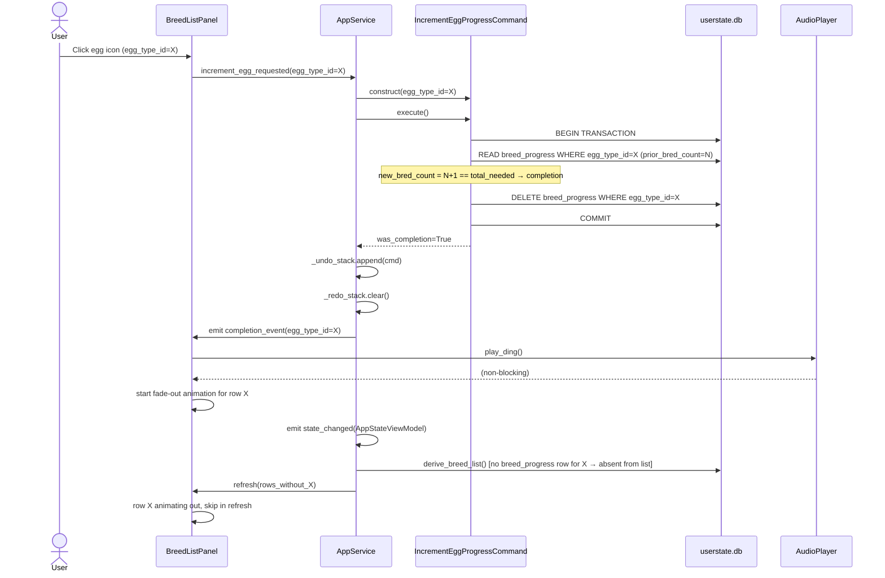

# Technical Design Document

## MSM Awakening Tracker — Desktop Companion Application

---

**Title:** MSM Awakening Tracker — Technical Design Document  
**Version:** 1.3  
**Status:** Draft — Post-Review Corrections Applied  
**Intended Audience:** Software engineers, QA engineers, project maintainer  
**Date:** 2025  

---

### Source Hierarchy

> **SRS v1.1 is the authoritative source** for all functional behavior, constraints, terminology, and acceptance criteria. The Vision / Q&A document provides supplementary context and product intent. In any case of conflict between the two, **the SRS wins**. Recommended Technical Decisions introduced in this TDD are clearly labeled and represent engineering judgment applied within the product scope; they do not expand or contract the product requirements.

---

## Table of Contents

1. [Document Control / Metadata](#1-document-control--metadata)
2. [Executive Summary](#2-executive-summary)
3. [Scope of the Technical Design](#3-scope-of-the-technical-design)
4. [Architectural Drivers](#4-architectural-drivers)
5. [System Context](#5-system-context)
6. [High-Level Architecture](#6-high-level-architecture)
7. [Proposed Project / Repository Structure](#7-proposed-project--repository-structure)
8. [Domain Model](#8-domain-model)
9. [Persistence Design](#9-persistence-design)
10. [Detailed Database Schema](#10-detailed-database-schema)
11. [State Management Design](#11-state-management-design)
12. [Reconciliation Design](#12-reconciliation-design)
13. [Undo / Redo Command Architecture](#13-undo--redo-command-architecture)
14. [Application Flows / Sequence Flows](#14-application-flows--sequence-flows)
15. [UI Architecture](#15-ui-architecture)
16. [View Models / Presentation Models](#16-view-models--presentation-models)
17. [Audio / Animation Integration](#17-audio--animation-integration)
18. [Update Subsystem Design](#18-update-subsystem-design)
19. [Asset Pipeline Design](#19-asset-pipeline-design)
20. [Error Handling and Recovery](#20-error-handling-and-recovery)
21. [Logging / Diagnostics](#21-logging--diagnostics)
22. [Performance Considerations](#22-performance-considerations)
23. [Security / Privacy / Licensing Considerations](#23-security--privacy--licensing-considerations)
24. [Testing Strategy](#24-testing-strategy)
25. [Risks and Mitigations](#25-risks-and-mitigations)
26. [Implementation Plan / Milestones](#26-implementation-plan--milestones)
27. [Open Questions / Decisions Needed](#27-open-questions--decisions-needed)
28. [Appendices](#28-appendices)

---

## 1. Document Control / Metadata

| Field              | Value                                                     |
| ------------------ | --------------------------------------------------------- |
| Document Title     | MSM Awakening Tracker — Technical Design Document         |
| TDD Version        | 1.3                                                       |
| Status             | Draft — Post-Review Corrections Applied                   |
| Intended Audience  | Software engineers, QA, project maintainer                |
| Source SRS         | MSM Awakening Tracker SRS v1.1                            |
| Supporting Context | MSM Companion App Vision & Q&A Document                   |
| Authority Rule     | SRS v1.1 supersedes Vision document where conflict exists |
| TDD Author         | Senior Technical Writer / Software Architect              |

**Source Artifacts Used:**

- `MSM_Awakening_Tracker_SRS_v1_1.md` — primary authority
- Vision / Q&A document — supporting product intent and background context

**Change History:**

| Version | Description                                                                                                                                                                                                                                                                                                                                                                                                                                                                                                                                                |
| ------- | ---------------------------------------------------------------------------------------------------------------------------------------------------------------------------------------------------------------------------------------------------------------------------------------------------------------------------------------------------------------------------------------------------------------------------------------------------------------------------------------------------------------------------------------------------------- |
| 1.0     | Initial TDD, derived from SRS v1.1                                                                                                                                                                                                                                                                                                                                                                                                                                                                                                                         |
| 1.1     | Post-review revision: resolved FR-410 phantom-progress ambiguity (player completion now deletes breed_progress row); made reconcile() a pure domain function (no DB connection arguments); fixed BreedProgress lifecycle contradiction; added content-update deprecation strategy for removed monsters; serialized update finalization with undo/redo stack clear; fixed asset resolution priority order in Architectural Drivers; promoted duplicate-instance close-out rule from Open Questions to main spec; removed resolved OQ-02 from Open Questions |
| 1.3     | Post-review corrections: fixed preamble SRS version reference (v1.2 → v1.1); updated Section 9.4 transaction table and Section 22.2 hot-path description to reflect delete-on-completion branch of IncrementEggProgressCommand (both previously implied pure UPSERT); resolved update metadata source-of-truth ambiguity in Section 8.7 (removed `db_version` and `content_last_updated` from app_settings — those are served exclusively by `content.db/update_metadata`; added SRS alignment note); corrected Section 14.8 comment attributing breed_progress deletion to Reconciliation (correct path is IncrementEggProgressCommand player-triggered completion); fixed Section 15.6 catalog search description to specify case-insensitive substring containment per SRS FR-203 (removed ambiguous `startswith()` reference); added SRS naming note to Section 13.5 aligning `IncrementEggProgressCommand` with SRS's `IncrementEggCommand` |
| 1.2     | Cleanup pass: aligned Document Control table version/status with header (was still showing v1.0 / "Ready for Engineering Review"); fixed Section 6.6 asset resolution order to match final precedence (downloaded cache → bundled install → placeholder); rewrote Section 14.3, Section 14.4, and Appendix G sequence diagram to reflect delete-on-completion design (removed stale UPSERT + remaining=0 path for completion case)                                                                                                                         |

---

## 2. Executive Summary

### What the System Is

The MSM Awakening Tracker is a lightweight, offline-first Windows desktop companion application for the mobile game *My Singing Monsters*. It allows a single player to track egg requirements needed to awaken Wublins, Celestials, and Amber Vessel monsters simultaneously. The player registers active targets, and the app maintains a single aggregated Breed List showing exactly which egg types are still needed and in what quantities. Progress is logged by clicking the egg icon for each row, and when a row is complete the app signals completion with a ding and removes the row.

### Why It Exists

The game itself provides no cross-island aggregated view of awakening requirements. Players working on two to five or more simultaneous targets must mentally track which eggs they still need across all targets — a cognitively expensive process that leads to wasted breeds. This app eliminates that friction.

### What the Architecture Is Optimizing For

The architecture optimizes for four properties in priority order:

1. **Correctness of the Breed List invariant** — at no point may orphaned or inconsistent rows exist in the Breed List. Reconciliation is the single enforcement mechanism and must be treated as such.
2. **Interaction speed** — every egg icon click must feel instant (< 100ms). All state transitions must complete within the same UI event loop cycle.
3. **Local reliability** — user state must survive crashes. Every action is persisted to SQLite before the UI confirms it.
4. **Simplicity of deployment** — the app ships as a standard Windows installer with no external runtime dependencies.

### MVP Implementation Slice

The MVP is a working vertical slice of the core loop:

> User opens app → sees Breed List and In-Work panel → adds targets from catalog → sees aggregated Breed List → clicks egg icons to log progress → rows complete and disappear with a ding → closes out finished targets → undo/redo all of the above → state survives restart.

The update subsystem, Settings screen, and packaging are secondary. The vertical slice must be correct before polish or features are layered on.

---

## 3. Scope of the Technical Design

### What This TDD Covers

- System architecture, module boundaries, and responsibilities
- Physical database schema with constraints, indexes, and migration strategy
- In-memory state model: what is persisted, what is derived, and when
- Reconciliation algorithm with pseudocode and worked examples
- Command pattern design with full specification for all three command types
- Sequence flows for all major user interactions
- UI architecture: view-model pattern, signal flow, list rendering approach
- Audio/animation integration and the player-completion vs. reconciliation-removal distinction
- Update subsystem design including staging, rollback, and fail-safe behavior
- Asset pipeline: layout, lookup, placeholder strategy
- Error handling and recovery specifications
- Logging strategy
- Testing strategy mapped to the riskiest logic
- Risk register with mitigations
- Build order / milestone plan

### What This TDD Does Not Cover

- Product UX redesign (the SRS defines the UX; this TDD implements it)
- Rare/Epic Wublins, Celestial Ascension, timers, or any feature listed in SRS Section 11 (Out of Scope)
- Multi-user, cloud sync, portable app, macOS/Linux support
- Any feature not grounded in the SRS

### Distinction: Requirements vs. Design Choices

| Item                                          | Source                                                     |
| --------------------------------------------- | ---------------------------------------------------------- |
| Breed List invariant, Reconciliation triggers | SRS v1.1 (FR-401, FR-408, Section 8.2) — required behavior |
| Two-DB split (content DB + user state DB)     | This TDD — **Recommended Technical Decision**              |
| SQLAlchemy vs. raw sqlite3                    | This TDD — **Recommended Technical Decision**              |
| MVP-first build order                         | This TDD — engineering judgment                            |
| Presenter/ViewModel pattern selection         | This TDD — **Recommended Technical Decision**              |

---

## 4. Architectural Drivers

The following constraints shape every significant design decision in this document.

| Driver                                 | Constraint / Requirement                                                          | Architectural Impact                                                                                                                         |
| -------------------------------------- | --------------------------------------------------------------------------------- | -------------------------------------------------------------------------------------------------------------------------------------------- |
| Offline-first operation                | Core functionality with zero network access (FR-802)                              | All data bundled; no runtime fetching; two local SQLite files                                                                                |
| Fast interaction response              | Egg click < 100ms; reconciliation + re-render < 200ms (NFR §5.1)                  | Synchronous in-process command execution; no async on hot path                                                                               |
| Single-user local deployment           | No accounts, no sync (FR-806)                                                     | No auth layer; user data in `%APPDATA%`; no network during normal operation                                                                  |
| Reliable persisted state               | State must survive crash (NFR-201)                                                | Every command persists before UI acknowledges; write-then-confirm pattern                                                                    |
| Breed List validity invariant          | No orphaned rows at any time (FR-401)                                             | Reconciliation embedded atomically in all commands that change target set                                                                    |
| Undo/redo correctness                  | Commands must fully reverse prior state including Reconciliation effects (FR-505) | Command objects capture full snapshot of pre-execute state for rollback                                                                      |
| Bundled assets with updateable content | Baseline assets at install; content data updateable via DB replacement (FR-804, FR-705) | Two-path asset resolution: cache → install bundle → placeholder (v1 uses install bundle only; cache reserved for future) |
| Maintainability of content updater     | Updater is modular and independently testable (NFR-403)                                | Updater is an isolated module with no direct coupling to UI or domain commands                                            |
| Strict Reconciliation reuse            | Reconciliation is a single reusable function (NFR-404)                            | `reconcile()` lives in the domain service layer, not inside any command class                                                                |
| Windows-only packaging                 | PyInstaller + Inno Setup/NSIS; bundled runtime (SRS §10.2–10.5)                   | All paths use `pathlib` with Windows conventions; asset paths use relative refs from app root                                                |

---

## 5. System Context

### Actors and External Systems

| Actor / System                 | Role                                                             |
| ------------------------------ | ---------------------------------------------------------------- |
| User                           | Single MSM player; interacts with all UI surfaces                |
| Content DB (`content.db`)      | Read-only SQLite; monsters, egg types, requirements, asset paths |
| User State DB (`userstate.db`) | Read-write SQLite; active targets, breed progress, settings      |
| Bundled Asset Store            | App install directory; egg icons, monster images, ding audio     |
| Downloaded Asset Cache         | `%APPDATA%\MSMAwakeningTracker\assets\`; reserved for future use (not populated in v1) |
| Content Update Server          | Remote; hosts manifest.json and prebuilt content.db artifacts    |

### System Context Diagram

```
┌─────────────────────────────────────────────────────────────────────┐
│                         User's Windows Machine                      │
│                                                                     │
│  ┌──────────────────────────────────────────────────────────────┐   │
│  │              MSM Awakening Tracker (PySide6 App)             │   │
│  │                                                              │   │
│  │   ┌──────────┐   ┌─────────────┐   ┌────────────────────┐  │   │
│  │   │  UI Layer │   │  App/Domain │   │  Update Subsystem  │  │   │
│  │   │ (PySide6) │◄──│   Layer     │   │  (manual trigger)  │  │   │
│  │   └──────────┘   └──────┬──────┘   └────────┬───────────┘  │   │
│  │                         │                    │              │   │
│  │             ┌───────────▼───────────┐        │              │   │
│  │             │   Data Access Layer   │        │              │   │
│  │             └───────────┬───────────┘        │              │   │
│  └─────────────────────────│────────────────────│──────────────┘   │
│                            │                    │                   │
│        ┌───────────────────┼───────────┐        │                   │
│        ▼                   ▼           ▼        ▼                   │
│  ┌──────────┐   ┌──────────────┐  ┌────────┐  ┌──────────────────┐ │
│  │ content  │   │  userstate   │  │Bundled │  │ Downloaded Asset  │ │
│  │  .db     │   │    .db       │  │Assets  │  │ Cache (%APPDATA%) │ │
│  │(read-only│   │ (read-write) │  │(install│  │                  │ │
│  │ content) │   │ (user state) │  │  dir)  │  │                  │ │
│  └──────────┘   └──────────────┘  └────────┘  └──────────────────┘ │
└─────────────────────────────────────────────────────────────────────┘
                                              │
                             (network, update only)
                                              │
                   ┌──────────────────────────▼────────────────────┐
                   │       External Update Sources (internet)       │
                   │   MSM Wiki / Fandom (MediaWiki API)            │
                   │   BBB Fan Kit (image assets)                   │
                   └───────────────────────────────────────────────┘
```

---

## 6. High-Level Architecture

The application is structured in four primary layers with two supporting subsystems. The dependency direction is strict: UI → App/Domain → Data Access. The Update subsystem is a peer of the App layer during its execution window, but writes only to the content DB and asset cache, never to user state.

### Layer Overview

#### 6.1 UI Layer (`app/ui/`)

**Responsibility:** Render the application state; translate user gestures into command invocations; receive domain events and update display accordingly.

**Key inputs:** User events (mouse clicks, keyboard shortcuts), domain events (breed list updated, row completed, row removed silently, undo/redo state changed).

**Key outputs:** Command invocations to the Application Service; queries to the ViewModel layer for display data.

**Dependencies:** Application Service layer, ViewModel layer.

**Stateful:** Minimal transient UI state only (e.g., which catalog tab is active, current search text). All domain state is owned by lower layers.

---

#### 6.2 Application / Service Layer (`app/services/`)

**Responsibility:** Orchestrate commands, manage the undo/redo stack, serve as the facade between the UI and the domain. Owns the in-memory undo stack and redo stack. Dispatches domain events after each command completes.

**Key inputs:** Command requests from UI (add target, close out target, increment egg, undo, redo).

**Key outputs:** Domain events to UI (state changed, completion event, silent removal event); updated ViewModel data.

**Dependencies:** Command objects, domain services (Reconciliation), repositories.

**Stateful:** Yes — owns undo stack and redo stack; does not persist them (stack resets on restart per FR-508).

---

#### 6.3 Domain / State Layer (`app/domain/`)

**Responsibility:** Implement business logic: the Reconciliation algorithm, Breed List derivation, completion detection, clip rule enforcement. This layer is free of UI and persistence concerns.

**Key inputs:** Snapshots of active targets, breed progress, and monster requirements from repositories.

**Key outputs:** `ReconciliationResult` value objects; derived Breed List row data; completion signals.

**Dependencies:** None outside the domain. Pure Python functions where possible.

**Stateful:** No — domain functions are pure transforms on data snapshots. State lives in the DB and in the command stack.

---

#### 6.4 Data Access Layer (`app/repositories/`)

**Responsibility:** All reads and writes to both SQLite databases. Owns transaction management, migration execution, and schema validation. Exposes typed Python objects, never raw cursor rows.

**Key inputs:** Domain objects and query parameters.

**Key outputs:** Domain model objects and collections.

**Dependencies:** `content.db` and `userstate.db` via `sqlite3` (see Section 9 for rationale over SQLAlchemy).

**Stateful:** No logic state; connection handles are managed per-session.

---

#### 6.5 Update Subsystem (`app/updater/`)

**Responsibility:** Fetch a remote manifest, download a prebuilt `content.db` artifact, validate it, stage it, and replace the local content database. Trigger post-update finalization (reconnect, reconcile, refresh). Roll back on failure. Never touches `userstate.db` directly — userstate modifications happen only during the post-update finalization pass (Section 18.13).

**Key inputs:** User trigger from Settings screen; current DB version metadata.

**Key outputs:** Replaced `content.db` on disk; update result (success/failure/no-change) reported to UI; finalization signal to main thread.

**Dependencies:** `urllib`; content DB validator; bootstrap connection helper.

**Stateful:** Maintains a staging area (`content_staging.db`) and backup (`content_backup.db`) during active update; discards staging on completion or failure.

> **v1 scope note:** The desktop updater installs prebuilt content database packages only. New monster discovery, requirement scraping, and image assembly are handled by the project maintainer's content-production pipeline, not by the installed client.

---

#### 6.6 Asset Management Layer (`app/assets/`)

**Responsibility:** Resolve asset paths at runtime using a two-tier lookup: asset cache first, bundled install assets second, placeholder third. In v1 the cache tier exists architecturally but is not populated by the updater; all media ships in the install bundle. Placeholder fallback is used for any asset not found in either location.

**Key inputs:** Relative asset path from `content.db` (e.g., `images/monsters/zynth.png`).

**Key outputs:** Absolute path to the correct image file.

**Dependencies:** Bundled asset directory (relative to app root); cache directory in `%APPDATA%` (unused in v1 but structurally present).

**Stateful:** No — pure lookup logic against the filesystem.

> **v1 scope note:** Installer-bundled assets are the sole media source of truth in v1. The cache directory path is wired but not populated by the update process. Future versions may populate it with downloaded assets.

---

#### 6.7 Packaging / Runtime Layer (`packaging/`)

**Responsibility:** PyInstaller spec files, Inno Setup/NSIS installer script, DB seeding scripts for the bundled `content.db`, path-bootstrapping code that runs at startup to set `DATA_DIR` and `ASSETS_DIR` correctly for both dev and packaged environments.

---

### Module Responsibility Summary

| Module                          | Layer           | Stateful            | Primary Responsibility                                  |
| ------------------------------- | --------------- | ------------------- | ------------------------------------------------------- |
| `ui/main_window.py`             | UI              | Transient           | Top-level window, navigation, keyboard shortcut binding |
| `ui/breed_list_panel.py`        | UI              | Transient           | Breed List widget, row rendering, animations            |
| `ui/inwork_panel.py`            | UI              | Transient           | In-Work panel widget                                    |
| `ui/catalog_panel.py`           | UI              | Transient           | Monster Catalog, tabs, search                           |
| `ui/settings_panel.py`          | UI              | Transient           | Settings screen, update trigger                         |
| `services/app_service.py`       | Application     | Yes (stacks)        | Command orchestration, undo/redo stack, event dispatch  |
| `domain/reconciliation.py`      | Domain          | No                  | Reconciliation algorithm, clip rule                     |
| `domain/breed_list.py`          | Domain          | No                  | Breed List derivation from DB snapshot                  |
| `commands/add_target.py`        | Domain/Commands | No (captured state) | AddTargetCommand                                        |
| `commands/close_out_target.py`  | Domain/Commands | No (captured state) | CloseOutTargetCommand                                   |
| `commands/increment_egg.py`     | Domain/Commands | No (captured state) | IncrementEggProgressCommand                             |
| `repositories/monster_repo.py`  | Data            | No                  | Monster and egg type reads                              |
| `repositories/target_repo.py`   | Data            | No                  | Active target reads/writes                              |
| `repositories/progress_repo.py` | Data            | No                  | Breed progress reads/writes                             |
| `repositories/settings_repo.py` | Data            | No                  | App settings reads/writes                               |
| `db/migrations.py`              | Data            | No                  | Migration runner                                        |
| `updater/scraper.py`            | Update          | No                  | Wiki API fetch and parse                                |
| `updater/commit.py`             | Update          | No                  | Stage-and-commit to content DB                          |
| `assets/resolver.py`            | Asset           | No                  | Two-tier asset path resolution                          |
| `assets/placeholder.py`         | Asset           | No                  | Placeholder image generation                            |

---

## 7. Proposed Project / Repository Structure

```
msm-awakening-tracker/
│
├── app/                            # Main application package
│   ├── __init__.py
│   ├── bootstrap.py                # App startup: path setup, DB init, migrations
│   │
│   ├── ui/                         # PySide6 UI layer
│   │   ├── __init__.py
│   │   ├── main_window.py          # QMainWindow subclass, navigation, shortcuts
│   │   ├── breed_list_panel.py     # Breed List widget + row delegate
│   │   ├── inwork_panel.py         # In-Work panel widget
│   │   ├── catalog_panel.py        # Monster Catalog panel + search
│   │   ├── settings_panel.py       # Settings / update screen
│   │   ├── viewmodels.py           # All ViewModel dataclasses
│   │   └── widgets/                # Reusable custom widgets
│   │       ├── egg_row_widget.py   # Individual Breed List row widget
│   │       └── monster_card.py     # Monster card used in catalog + in-work
│   │
│   ├── services/
│   │   ├── __init__.py
│   │   └── app_service.py          # Command orchestrator + undo/redo stack
│   │
│   ├── domain/
│   │   ├── __init__.py
│   │   ├── models.py               # Dataclasses: Monster, EggType, BreedRow, etc.
│   │   ├── reconciliation.py       # reconcile() — THE single reconciliation function
│   │   └── breed_list.py           # derive_breed_list() — pure derivation function
│   │
│   ├── commands/
│   │   ├── __init__.py
│   │   ├── base.py                 # Abstract Command base class
│   │   ├── add_target.py           # AddTargetCommand
│   │   ├── close_out_target.py     # CloseOutTargetCommand
│   │   └── increment_egg.py        # IncrementEggProgressCommand
│   │
│   ├── repositories/
│   │   ├── __init__.py
│   │   ├── base.py                 # DB connection management, helpers
│   │   ├── monster_repo.py         # Monster + EggType reads
│   │   ├── target_repo.py          # ActiveTarget CRUD
│   │   ├── progress_repo.py        # BreedProgress CRUD
│   │   └── settings_repo.py        # AppSettings CRUD
│   │
│   ├── db/
│   │   ├── __init__.py
│   │   ├── connection.py           # Connection factory; returns (content_conn, userstate_conn)
│   │   ├── migrations.py           # Migration runner (applies pending migrations in order)
│   │   └── migrations/             # Numbered migration scripts
│   │       ├── content/
│   │       │   ├── 0001_initial_schema.sql
│   │       │   └── 0002_add_wiki_slug.sql
│   │       └── userstate/
│   │           ├── 0001_initial_schema.sql
│   │           └── ...
│   │
│   ├── updater/
│   │   ├── __init__.py
│   │   ├── scraper.py              # MediaWiki API fetch + parse
│   │   ├── asset_fetcher.py        # Image download from Fan Kit
│   │   ├── validator.py            # Validate fetched data before commit
│   │   ├── commit.py               # Atomic stage-and-commit to content DB
│   │   └── manifest.py             # UpdateManifest and AssetManifest dataclasses
│   │
│   └── assets/
│       ├── __init__.py
│       ├── resolver.py             # Two-tier path resolution logic
│       └── placeholder.py          # Placeholder image generation (PIL/Pillow)
│
├── resources/                      # Bundled static assets (included in PyInstaller build)
│   ├── db/
│   │   └── content.db              # Seeded content database (bundled at build time)
│   ├── images/
│   │   ├── monsters/               # BBB Fan Kit monster images
│   │   ├── eggs/                   # BBB Fan Kit egg icons
│   │   └── ui/                     # App UI icons, logo, etc.
│   └── audio/
│       └── ding.wav                # Completion ding audio
│
├── scripts/
│   ├── seed_content_db.py          # Build-time script: populates content.db from source data
│   ├── fetch_fan_kit.py            # Build-time script: downloads BBB Fan Kit images
│   └── generate_placeholders.py   # Build-time script: creates placeholder images
│
├── packaging/
│   ├── msm_tracker.spec            # PyInstaller spec
│   ├── installer.iss               # Inno Setup installer script
│   └── build.py                    # Build orchestration script
│
├── tests/
│   ├── unit/
│   │   ├── test_reconciliation.py
│   │   ├── test_breed_list.py
│   │   ├── test_commands.py
│   │   └── test_asset_resolver.py
│   ├── integration/
│   │   ├── test_repositories.py
│   │   ├── test_migrations.py
│   │   └── test_update_pipeline.py
│   └── conftest.py                 # pytest fixtures (in-memory DB setup, etc.)
│
├── main.py                         # Entry point: called by PyInstaller
├── requirements.txt
└── README.md
```

---

## 8. Domain Model

This section defines the core domain entities, value objects, and data structures used throughout the application. All entities are implemented as Python `dataclass` objects unless noted.

---

### 8.1 Monster

**Purpose:** Represents one awakening target type in the catalog.

| Field            | Type          | Notes                                          |
| ---------------- | ------------- | ---------------------------------------------- |
| `id`             | `int`         | Primary key, internal                          |
| `name`           | `str`         | Display name (e.g., "Wubbox")                  |
| `monster_type`   | `MonsterType` | Enum: `WUBLIN`, `CELESTIAL`, `AMBER`           |
| `image_path`     | `str`         | Relative asset path; resolved at runtime       |
| `is_placeholder` | `bool`        | True if no Fan Kit image available             |
| `wiki_slug`      | `str`         | Fandom wiki page identifier for update lookups |

**Invariants:** `name` is non-empty; `monster_type` is one of the three valid values; `id` is unique.

**Lifecycle:** Created at DB seed/update time; never modified by user action.

---

### 8.2 EggType

**Purpose:** Represents one egg type used in awakening requirements (corresponds to a specific MSM monster whose egg is zapped).

| Field                   | Type  | Notes                                        |
| ----------------------- | ----- | -------------------------------------------- |
| `id`                    | `int` | Primary key                                  |
| `name`                  | `str` | Display name (e.g., "Mammott")               |
| `breeding_time_seconds` | `int` | Sort key for descending/ascending time sorts |
| `breeding_time_display` | `str` | Human-readable (e.g., "8h 30m")              |
| `egg_image_path`        | `str` | Relative asset path to egg icon              |

**Invariants:** `breeding_time_seconds` > 0; `name` is unique.

**Lifecycle:** Created at DB seed/update time; never modified by user action.

---

### 8.3 MonsterRequirement

**Purpose:** Represents the quantity of one egg type required to awaken one instance of a monster.

| Field         | Type  | Notes                                       |
| ------------- | ----- | ------------------------------------------- |
| `monster_id`  | `int` | FK → Monster                                |
| `egg_type_id` | `int` | FK → EggType                                |
| `quantity`    | `int` | How many of this egg type are required; > 0 |

**Invariants:** `(monster_id, egg_type_id)` is unique; `quantity` ≥ 1.

**Lifecycle:** Created at seed/update time; read-only at runtime.

---

### 8.4 ActiveTarget

**Purpose:** Represents one instance of a monster being actively worked on by the player.

| Field        | Type       | Notes                                                                          |
| ------------ | ---------- | ------------------------------------------------------------------------------ |
| `id`         | `int`      | Primary key (autoincrement)                                                    |
| `monster_id` | `int`      | FK → Monster                                                                   |
| `added_at`   | `datetime` | UTC timestamp of when the target was added; used for ordering in In-Work panel |

**Invariants:** Multiple rows with the same `monster_id` are valid (duplicate targets per FR-206).

**Lifecycle:** Inserted by `AddTargetCommand.execute()`; deleted by `CloseOutTargetCommand.execute()`. Restored/deleted by corresponding `undo()` methods.

---

### 8.5 BreedProgress

**Purpose:** Tracks the cumulative number of eggs of one type the player has bred across all active targets.

| Field         | Type  | Notes                                                                  |
| ------------- | ----- | ---------------------------------------------------------------------- |
| `egg_type_id` | `int` | PK and FK → EggType                                                    |
| `bred_count`  | `int` | Running total of eggs bred; 0 ≤ bred_count ≤ total_needed at all times |

**Invariants:** `bred_count` ≥ 0. The clip rule (Section 12) enforces `bred_count` ≤ `total_needed` after every Reconciliation. When a player completes a row (bred_count reaches total_needed via increment), the `breed_progress` row is **deleted from the DB immediately** — see Section 11.5 and 13.5 for detail.

**Lifecycle:** Created lazily on first increment for an egg type. Deleted in two distinct situations: (a) by `IncrementEggProgressCommand.execute()` when the increment causes player completion, and (b) by Reconciliation when no active target requires the egg type (orphan purge). Reconciliation **never creates** new `breed_progress` rows — only deletes or clips existing ones.

---

### 8.6 BreedListRow (Derived Value Object)

**Purpose:** The computed view of one row in the Breed List, derived on demand from `BreedProgress` and `MonsterRequirement` data for the current active target set. Not directly persisted — it is always recomputed.

| Field                   | Type  | Notes                                         |
| ----------------------- | ----- | --------------------------------------------- |
| `egg_type_id`           | `int` | Source egg type                               |
| `name`                  | `str` | Display name                                  |
| `breeding_time_seconds` | `int` | Sort key                                      |
| `breeding_time_display` | `str` | Formatted string                              |
| `egg_image_path`        | `str` | Resolved absolute path                        |
| `total_needed`          | `int` | Sum of requirements across all active targets |
| `bred_count`            | `int` | From BreedProgress                            |
| `remaining`             | `int` | `total_needed - bred_count`                   |

**Invariants:** Only rows where `remaining > 0` are rendered. `remaining` is always ≥ 0 (enforced by clip rule).

---

### 8.7 AppSettings

**Purpose:** Key-value store for application preferences and runtime state. Stored in `userstate.db/app_settings`.

> **Source-of-truth note:** Content versioning metadata (`content_version`, `last_updated_utc`, `source`) lives exclusively in `content.db/update_metadata` (see Section 10.1). The Settings screen reads version and timestamp data from `content.db` directly — they are **not** duplicated in `app_settings`. This avoids the ambiguity of maintaining the same values in two locations and keeps user state cleanly separated from content metadata.

| Key                               | Type  | Default             | Notes                                                                                                                               |
| --------------------------------- | ----- | ------------------- | ----------------------------------------------------------------------------------------------------------------------------------- |
| `breed_list_sort_order`           | `str` | `"time_desc"`       | One of: `time_desc`, `time_asc`, `remaining_desc`, `name_asc`                                                                       |
| `last_reconciled_content_version` | `str` | Set at first launch | Tracks which content version was last fully reconciled; used to detect and recover from interrupted post-update finalization passes |

> **SRS alignment note:** SRS Section 7.6 lists `db_version` and `db_last_updated` as tracked settings. In this TDD, those values are served by `content.db/update_metadata` (`content_version` and `last_updated_utc`). The SRS-level intent — that the Settings screen can display a version label and last-updated timestamp — is fully satisfied; only the storage location is a TDD design decision.

---

### 8.8 ReconciliationResult (Value Object)

**Purpose:** Captures what Reconciliation changed, used by the undo machinery to restore prior state exactly.

| Field                     | Type             | Notes                                                          |
| ------------------------- | ---------------- | -------------------------------------------------------------- |
| `deleted_egg_type_ids`    | `list[int]`      | Egg types whose BreedProgress rows were deleted (orphaned)     |
| `clipped_egg_types`       | `dict[int, int]` | `egg_type_id` → old `bred_count` before clipping               |
| `prior_progress_snapshot` | `dict[int, int]` | Full `{egg_type_id: bred_count}` snapshot before reconcile ran |

This value object is captured inside the command before Reconciliation mutates the DB, enabling exact restoration during undo.

---

### 8.9 Command / UndoStack / RedoStack

**Purpose:** Encapsulate reversible user actions and support undo/redo (see Section 13 for full design).

| Concept     | Type                | Notes                                                     |
| ----------- | ------------------- | --------------------------------------------------------- |
| `Command`   | Abstract base class | `execute()`, `undo()` interface                           |
| `UndoStack` | `list[Command]`     | LIFO stack; owned by `AppService`                         |
| `RedoStack` | `list[Command]`     | LIFO stack; owned by `AppService`; cleared on new execute |

---

### 8.10 UpdateManifest (Value Object)

**Purpose:** Describes the result of a wiki scrape: new monsters found, existing monsters with changed data, new images to fetch.

| Field               | Type                | Notes                                               |
| ------------------- | ------------------- | --------------------------------------------------- |
| `new_monsters`      | `list[MonsterSeed]` | Monsters not present in local DB                    |
| `updated_monsters`  | `list[MonsterSeed]` | Monsters with changed requirements or times         |
| `new_egg_types`     | `list[EggTypeSeed]` | Egg types not in local DB                           |
| `updated_egg_types` | `list[EggTypeSeed]` | Egg types with changed data                         |
| `images_to_fetch`   | `list[ImageSpec]`   | (monster_id or egg_type_id, url, local_path) tuples |
| `fetched_at`        | `datetime`          | UTC timestamp of scrape                             |

---

### 8.11 MonsterType Enum

```python
class MonsterType(str, Enum):
    WUBLIN = "wublin"
    CELESTIAL = "celestial"
    AMBER = "amber"
```

Stored as a lowercase string in SQLite; validated on read.

---

### 8.12 SortOrder Enum

```python
class SortOrder(str, Enum):
    TIME_DESC = "time_desc"
    TIME_ASC = "time_asc"
    REMAINING_DESC = "remaining_desc"
    NAME_ASC = "name_asc"
```

---

## 9. Persistence Design

### 9.1 Two-Database Architecture

**Recommended Technical Decision:** Split storage into two separate SQLite files:

| Database      | File           | Location                                     | Ownership                                                           |
| ------------- | -------------- | -------------------------------------------- | ------------------------------------------------------------------- |
| Content DB    | `content.db`   | `%APPDATA%\MSMAwakeningTracker\content.db`   | Read-only during normal operation; written by Update subsystem only |
| User State DB | `userstate.db` | `%APPDATA%\MSMAwakeningTracker\userstate.db` | Read-write; owned by the app during normal operation                |

**Rationale:**

- The content DB may need to be replaced entirely during an update (stage-and-swap). If user state lived in the same file, a failed update could corrupt user progress.
- Clear separation means the update subsystem can validate a new `content.db` in a staging location before committing, with zero risk to user state.
- For backup purposes, a user can copy `userstate.db` without copying the content DB.
- Schema migrations on each DB are independent and cannot interfere.

The bundled `content.db` ships inside `resources/db/` in the install package. On first launch, `bootstrap.py` copies it to `%APPDATA%\MSMAwakeningTracker\content.db` if not already present.

---

### 9.2 Raw sqlite3 vs. SQLAlchemy

**Recommended Technical Decision:** Use Python's built-in `sqlite3` module directly rather than SQLAlchemy.

**Rationale:**

- The schema is small and well-defined; an ORM layer adds complexity without meaningful benefit here.
- SQLite with `sqlite3` has no additional install footprint.
- All queries are straightforward CRUD; there are no complex joins that would benefit from ORM query building.
- Explicit SQL in repository methods is easier to audit for correctness in a correctness-critical domain.
- Migrations are plain `.sql` files run by a simple migration runner — no ORM migration tooling needed.

Connection management: one persistent connection per DB per app session, opened in `bootstrap.py`, passed via the repository factory.

Enable WAL mode for `userstate.db` to minimize contention risk and improve crash safety:

```sql
PRAGMA journal_mode=WAL;
PRAGMA synchronous=NORMAL;
```

---

### 9.3 Schema Versioning and Migration Strategy

Each DB file maintains its own migration version in a `schema_migrations` table. On launch, `bootstrap.py` calls `run_migrations(conn, db_name)` which:

1. Reads current `MAX(version)` from `schema_migrations` (or 0 if table doesn't exist).
2. Scans the appropriate `db/migrations/<db_name>/` directory for `.sql` files named `NNNN_description.sql`.
3. Applies any migration files with version number > current version, in ascending order, each wrapped in a transaction.
4. Records each applied migration in `schema_migrations`.

**Migration ordering rule:** Migrations are never reordered. New migrations always get the next integer. Applied migrations are never edited; instead, a new migration corrects any error.

---

### 9.4 Transaction Boundaries

| Operation                               | Transaction Scope                                                                   |
| --------------------------------------- | ----------------------------------------------------------------------------------- |
| `AddTargetCommand.execute()`            | Single transaction: INSERT active_target + full Reconciliation mutations            |
| `CloseOutTargetCommand.execute()`       | Single transaction: DELETE active_target + full Reconciliation mutations            |
| `IncrementEggProgressCommand.execute()` | Single transaction: UPSERT `breed_progress` (normal increment) or DELETE `breed_progress` row (completion) |
| Any `undo()`                            | Single transaction: reverse of execute() including Reconciliation state restoration |
| Content DB update (Update subsystem)    | Separate transaction on content.db only; never touches userstate.db                 |
| Migration                               | Each individual migration script is its own transaction                             |

The rule: **if Reconciliation is embedded in a command, the entire command + Reconciliation executes in one `BEGIN / COMMIT` block.** A failure inside Reconciliation triggers `ROLLBACK`, leaving both active_targets and breed_progress in their prior state.

---

### 9.5 Path Storage Strategy for Assets

Asset paths stored in the content DB are **relative paths from the app's resource root**, not absolute paths. The asset resolver (`app/assets/resolver.py`) converts them to absolute paths at runtime by joining with the appropriate base directory.

Example stored value: `images/eggs/mammott_egg.png`

Runtime resolution: `ASSETS_DIR / "images/eggs/mammott_egg.png"` where `ASSETS_DIR` is established by `bootstrap.py` based on whether running from source or as a PyInstaller bundle.

Downloaded/updated assets are stored in `%APPDATA%\MSMAwakeningTracker\assets\` using the same relative path structure, enabling easy override lookup.

---

### 9.6 Timestamp Strategy

All timestamps stored as ISO 8601 UTC strings (`YYYY-MM-DDTHH:MM:SS.ffffffZ`) in TEXT columns. Retrieved and compared using Python `datetime` with UTC timezone. This avoids SQLite timezone ambiguity and is human-readable in direct DB inspection.

---

### 9.7 Enum Storage Strategy

All enums stored as their string value (e.g., `"wublin"`, `"time_desc"`). Validated against the enum class on read. Invalid values trigger a logged warning and a safe default, not a crash.

---

### 9.8 Backup and Recovery Considerations

- No automatic backup mechanism is provided in v1.
- Because user state is isolated in `userstate.db`, users can manually back it up.
- The update subsystem never modifies `userstate.db`.
- If `userstate.db` is corrupted or absent, `bootstrap.py` creates a fresh empty one — user state is lost but the app recovers cleanly (see Section 20).
- If `content.db` is corrupted, the app attempts to re-copy the bundled baseline version from the install directory.

---

## 10. Detailed Database Schema

### 10.1 Content Database (`content.db`)

All content tables are read-only at runtime. They are written only by the seed script (build time) and the update subsystem.

---

#### Table: `monsters`

```sql
CREATE TABLE monsters (
    id                  INTEGER PRIMARY KEY AUTOINCREMENT,
    name                TEXT    NOT NULL UNIQUE,
    monster_type        TEXT    NOT NULL CHECK(monster_type IN ('wublin','celestial','amber')),
    image_path          TEXT    NOT NULL,
    is_placeholder      INTEGER NOT NULL DEFAULT 0 CHECK(is_placeholder IN (0,1)),
    wiki_slug           TEXT    NOT NULL UNIQUE,
    is_deprecated       INTEGER NOT NULL DEFAULT 0 CHECK(is_deprecated IN (0,1))
);

CREATE INDEX idx_monsters_type ON monsters(monster_type);
CREATE INDEX idx_monsters_deprecated ON monsters(is_deprecated);
```

**Notes:** `monster_type` uses a CHECK constraint to enforce the enum values. `is_placeholder = 1` indicates no Fan Kit image is available; the asset resolver will serve a generated placeholder. `wiki_slug` is used by the update scraper for precise page lookups. `is_deprecated = 1` marks monsters that have been removed or retired from the game; they are excluded from the catalog but their rows are retained so that referential integrity and content history are preserved. Monsters are **never hard-deleted** from `content.db` — see Section 18.13 for the deprecation policy.

---

#### Table: `egg_types`

```sql
CREATE TABLE egg_types (
    id                      INTEGER PRIMARY KEY AUTOINCREMENT,
    name                    TEXT    NOT NULL UNIQUE,
    breeding_time_seconds   INTEGER NOT NULL CHECK(breeding_time_seconds > 0),
    breeding_time_display   TEXT    NOT NULL,
    egg_image_path          TEXT    NOT NULL,
    is_placeholder          INTEGER NOT NULL DEFAULT 0 CHECK(is_placeholder IN (0,1))
);

CREATE INDEX idx_egg_types_breeding_time ON egg_types(breeding_time_seconds);
```

**Notes:** `breeding_time_seconds` is the sort key; the index supports fast sort-by-time queries. `breeding_time_display` is pre-formatted and stored to avoid repeated formatting at render time.

---

#### Table: `monster_requirements`

```sql
CREATE TABLE monster_requirements (
    monster_id      INTEGER NOT NULL REFERENCES monsters(id) ON DELETE CASCADE,
    egg_type_id     INTEGER NOT NULL REFERENCES egg_types(id) ON DELETE RESTRICT,
    quantity        INTEGER NOT NULL CHECK(quantity >= 1),
    PRIMARY KEY (monster_id, egg_type_id)
);

CREATE INDEX idx_req_monster ON monster_requirements(monster_id);
CREATE INDEX idx_req_egg_type ON monster_requirements(egg_type_id);
```

**Notes:** Composite primary key enforces one row per (monster, egg type) pair. `ON DELETE CASCADE` on `monster_id` cleans up requirements if a monster entry is removed during update. `ON DELETE RESTRICT` on `egg_type_id` prevents deletion of an egg type still referenced by requirements.

---

#### Table: `update_metadata`

```sql
CREATE TABLE update_metadata (
    key     TEXT PRIMARY KEY,
    value   TEXT NOT NULL
);
-- Seeded rows:
-- ('content_version', '1.0.0')
-- ('last_updated_utc', '2025-01-01T00:00:00.000000Z')
-- ('source', 'seed')
```

**Notes:** A simple key-value store for content versioning metadata. Read by the Settings screen to display "Last updated" information.

---

#### Table: `schema_migrations` (content)

```sql
CREATE TABLE schema_migrations (
    version     INTEGER PRIMARY KEY,
    name        TEXT    NOT NULL,
    applied_at  TEXT    NOT NULL
);
```

---

### 10.2 User State Database (`userstate.db`)

---

#### Table: `active_targets`

```sql
CREATE TABLE active_targets (
    id          INTEGER PRIMARY KEY AUTOINCREMENT,
    monster_id  INTEGER NOT NULL,
    added_at    TEXT    NOT NULL
    -- No FK to content.db; cross-DB FK enforcement not supported in SQLite
    -- Referential integrity enforced in application code
);

CREATE INDEX idx_active_targets_monster ON active_targets(monster_id);
CREATE INDEX idx_active_targets_added ON active_targets(added_at);
```

**Notes:** Multiple rows with the same `monster_id` are explicitly allowed (FR-206, duplicate targets). The `added_at` field is used to order entries in the In-Work panel. No cross-DB foreign key is possible in SQLite; the repository layer validates `monster_id` exists in `content.db` before inserting.

---

#### Table: `breed_progress`

```sql
CREATE TABLE breed_progress (
    egg_type_id     INTEGER PRIMARY KEY,
    bred_count      INTEGER NOT NULL DEFAULT 0 CHECK(bred_count >= 0)
    -- No FK cross-DB; validated in application code
);
```

**Notes:** One row per egg type with any breeding history. Reconciliation deletes rows where the egg type is no longer needed. The PRIMARY KEY on `egg_type_id` means UPSERT logic is straightforward (`INSERT OR REPLACE` or `ON CONFLICT DO UPDATE`). The `bred_count >= 0` CHECK prevents negative values from a software bug.

---

#### Table: `app_settings`

```sql
CREATE TABLE app_settings (
    key     TEXT PRIMARY KEY,
    value   TEXT NOT NULL
);
-- Seeded on first launch:
-- ('breed_list_sort_order', 'time_desc')
-- ('userstate_schema_version', '1')
```

---

#### Table: `schema_migrations` (userstate)

```sql
CREATE TABLE schema_migrations (
    version     INTEGER PRIMARY KEY,
    name        TEXT    NOT NULL,
    applied_at  TEXT    NOT NULL
);
```

---

### 10.3 Cross-DB Reference Enforcement

Because SQLite does not support foreign keys across database files (even with `ATTACH`), referential integrity between `userstate.db` and `content.db` is enforced by the repository layer:

- **Before inserting into `active_targets`:** verify `monster_id` exists in `content.db/monsters` AND `is_deprecated = 0`. Adding a deprecated monster is rejected with a logged error.
- **Before inserting/updating `breed_progress`:** verify `egg_type_id` exists in `content.db/egg_types`.
- **After a content DB update:** the post-update finalization pass (Section 18.13) handles any `active_targets` rows that now reference deprecated monsters: they are removed and the user is notified. Breed progress for egg types whose totals drop to zero is purged by Reconciliation.

**Content deprecation policy:** Monsters and egg types are **never hard-deleted** from `content.db`. If the update scraper determines a monster no longer exists or has been retired, it sets `is_deprecated = 1`. This preserves referential history and allows the post-update pass to clean up user state gracefully rather than encountering dangling references. Egg types follow the same rule: they are never deleted, only deprecated if they are no longer used by any non-deprecated monster's requirements.

---

## 11. State Management Design

### 11.1 Authoritative State

| State                        | Location                       | Authority                                |
| ---------------------------- | ------------------------------ | ---------------------------------------- |
| Active targets               | `userstate.db/active_targets`  | Database is the single source of truth   |
| Breed progress (bred counts) | `userstate.db/breed_progress`  | Database is the single source of truth   |
| Sort preference              | `userstate.db/app_settings`    | Database is the single source of truth   |
| Undo/Redo stack              | In-memory, `AppService`        | Memory only; cleared on restart (FR-508) |
| Monster catalog data         | `content.db`                   | Database is the single source of truth   |
| Breed List display           | Derived at render time from DB | Never persisted directly                 |

### 11.2 What Is Derived vs. Persisted

The Breed List as a rendered collection is **always derived on demand** from the current DB state; it is never stored as a separate table or in-memory cache. This is the core consequence of FR-408 (Reconciliation as single source of truth) — the UI always reflects the DB, and the DB is always valid.

**Derivation function** (called after every state change to refresh the UI):

```python
def derive_breed_list(
    active_targets: list[ActiveTarget],
    requirements: dict[int, list[MonsterRequirement]],  # monster_id → [req]
    progress: dict[int, int],  # egg_type_id → bred_count
    egg_types: dict[int, EggType],  # egg_type_id → EggType
    sort_order: SortOrder,
) -> list[BreedListRow]:
    totals: dict[int, int] = {}
    for target in active_targets:
        for req in requirements[target.monster_id]:
            totals[req.egg_type_id] = totals.get(req.egg_type_id, 0) + req.quantity

    rows = []
    for egg_type_id, total_needed in totals.items():
        bred_count = progress.get(egg_type_id, 0)
        remaining = total_needed - bred_count
        if remaining > 0:
            et = egg_types[egg_type_id]
            rows.append(BreedListRow(
                egg_type_id=egg_type_id,
                name=et.name,
                breeding_time_seconds=et.breeding_time_seconds,
                breeding_time_display=et.breeding_time_display,
                egg_image_path=resolver.resolve(et.egg_image_path),
                total_needed=total_needed,
                bred_count=bred_count,
                remaining=remaining,
            ))

    return sorted(rows, key=sort_key_for(sort_order))
```

This function is pure and side-effect-free. It is called by the UI layer (via `AppService`) after every command completes.

### 11.3 State Load on App Startup

1. `bootstrap.py` establishes DB connections; runs migrations on both DBs.
2. `AppService` is initialized with repository references.
3. `AppService.load_initial_state()` reads:
   - All `active_targets` from userstate DB
   - All relevant `monster_requirements` from content DB (for the loaded monster IDs)
   - All `breed_progress` from userstate DB
   - `breed_list_sort_order` from settings
4. `derive_breed_list()` is called and the result is passed to the UI for initial render.
5. Undo and redo stacks are initialized empty.

### 11.4 State Flush on Every Action

The write-then-confirm pattern: every command writes to the DB inside its transaction **before** the UI is updated. The sequence for any command `cmd`:

```
cmd.execute()         # writes to DB atomically
ui.refresh_state()    # reads from DB and re-renders
```

If `cmd.execute()` raises an exception (transaction rolled back), the UI is NOT updated and an error is surfaced to the user. The DB remains in its pre-command state.

### 11.5 Completed Rows

When a player increment causes `bred_count == total_needed`, the row is considered complete. The behavior is:

1. A `CompletionEvent` is emitted by `AppService` (triggers ding + fade animation in the UI).
2. `IncrementEggProgressCommand.execute()` **deletes the `breed_progress` row** from the DB immediately after the increment that causes completion.
3. The Breed List derivation naturally produces no row for this egg type on next refresh (no progress row, and even if `total_needed` were computed, `bred_count` defaults to 0 which means it would appear if `total_needed > 0` — but because the row is deleted, it stays gone).

**Why delete on completion rather than retain:**
This is the clean resolution to FR-410 ("no phantom progress"). If the `breed_progress` row were retained at `bred_count == total_needed` and a new target were later added requiring the same egg type, Reconciliation's clip rule could allow the old progress to persist, violating FR-410's requirement that the row restart at `bred = 0`.

Deleting on completion makes FR-410 trivially correct: when a new target reintroduces a previously-completed egg type, there is no `breed_progress` row to carry forward.

**Undo is still supported:** `IncrementEggProgressCommand` captures `prior_bred_count` and the `was_completion` flag before executing. On `undo()`, it re-inserts the `breed_progress` row with `prior_bred_count = total - 1`. The row reappears silently with `bred = total - 1, remaining = 1`.

**Distinct from Reconciliation orphan deletion:** Reconciliation deletes `breed_progress` rows for egg types that are no longer required by any active target (orphan purge). This is a different trigger path and a different semantic. Both result in a deleted row, but their causes and undo behaviors differ:

- Player-completion deletion: reversed by `IncrementEggProgressCommand.undo()`
- Reconciliation orphan deletion: reversed by restoring `prior_progress_snapshot` in `AddTargetCommand.undo()` or `CloseOutTargetCommand.undo()`

### 11.6 Previously Completed + New Target Reintroduces Egg Type

This scenario is now cleanly handled by the deletion-on-completion design:

**Scenario:** Player completes Mammott (bred_count reached total_needed). The `breed_progress` row for Mammott is deleted. Later, the player adds a new target requiring 4 Mammott.

**After `AddTargetCommand.execute()`:**

1. New active target inserted.
2. Reconciliation runs: `required_totals = { Mammott: 4 }`. No `breed_progress` row for Mammott exists → no orphan, no clip. No-op.
3. `derive_breed_list()` computes: `total_needed = 4`, `bred_count = 0` (no row, defaults to 0), `remaining = 4`.
4. Mammott row appears in Breed List as `0 / 4`. ✓ FR-410 satisfied.

**No special case handling is needed.** The deletion-on-completion rule eliminates the phantom-progress ambiguity entirely. The clip rule and Reconciliation algorithm remain unchanged; they simply never encounter a stale completed-row because it no longer exists.

### 11.7 Sort Preference Persistence

Sort preference is:

- Written to `userstate.db/app_settings` immediately when the user changes it (no batching).
- Read from DB on every launch.
- Stored as a string value matching `SortOrder` enum values.

### 11.8 Crash Recovery

Because every command writes to DB before the UI confirms, a crash between two commands leaves the DB in a valid, committed state (WAL mode + `synchronous=NORMAL` minimizes the window). On next launch, the state is re-read from DB. The undo stack is lost (by design, FR-508), but user progress data is intact.

---

## 12. Reconciliation Design

### 12.1 Purpose

Reconciliation enforces the **Breed List invariant** (FR-401): *every egg type in the Breed List is required by at least one currently active target, and `bred_count ≤ total_needed` for every egg type.*

Reconciliation is the **only** mechanism that enforces this invariant. It is never bypassed.

### 12.2 Trigger Points

| Trigger             | Who Calls reconcile()             |
| ------------------- | --------------------------------- |
| Add target          | `AddTargetCommand.execute()`      |
| Undo an add target  | `AddTargetCommand.undo()`         |
| Close out target    | `CloseOutTargetCommand.execute()` |
| Undo a close-out    | `CloseOutTargetCommand.undo()`    |
| Post-content-update | `UpdateCommitService.finalize()`  |

**Reconciliation is never called by `IncrementEggProgressCommand`** (SRS Section 8.5 note).

### 12.3 Architecture: Pure Domain Function

**Recommended Technical Decision:** `reconcile()` is implemented as a **pure Python function** in `app/domain/reconciliation.py`. It takes in-memory data snapshots as arguments and returns a `ReconciliationResult` describing what must change. It does not accept database connections and makes no direct DB mutations.

The calling context (a command's `execute()` or `undo()` method) is responsible for:

1. Reading current state from repositories (before the transaction alters it)
2. Calling `reconcile()` with the in-memory snapshot
3. Applying the returned `ReconciliationResult` delta to the DB via repositories, within the same open transaction

This separation means:

- Reconciliation logic is fully testable with plain Python data, no DB fixture needed
- The domain layer has zero persistence dependencies
- The application/command layer owns the transaction; it coordinates reads, the pure reconcile call, and the writes as one unit

### 12.4 Inputs

```python
def reconcile(
    active_targets: list[ActiveTarget],
    requirements: dict[int, list[MonsterRequirement]],  # monster_id → [req]
    current_progress: dict[int, int],                   # egg_type_id → bred_count
) -> ReconciliationResult:
```

- `active_targets`: the current active target list **as it will be after the triggering mutation** (i.e., after the INSERT or DELETE is applied in the transaction, the command fetches the updated list before calling reconcile)
- `requirements`: full `monster_requirements` for all relevant monsters, read from the content DB (may be cached in-memory at startup)
- `current_progress`: full `breed_progress` snapshot from userstate DB

### 12.5 Outputs

- `ReconciliationResult` value object describing the delta to apply (which rows to delete, which to clip)
- The calling command applies this delta to the DB via `progress_repo`

### 12.6 Algorithm

```python
def reconcile(
    active_targets: list[ActiveTarget],
    requirements: dict[int, list[MonsterRequirement]],
    current_progress: dict[int, int],
) -> ReconciliationResult:
    """
    Pure function. No DB access. No side effects.
    Returns a ReconciliationResult describing what the DB should change.
    """

    # Step 1: Compute required totals from the (already updated) active target list
    required_totals: dict[int, int] = {}
    for target in active_targets:
        for req in requirements.get(target.monster_id, []):
            required_totals[req.egg_type_id] = (
                required_totals.get(req.egg_type_id, 0) + req.quantity
            )

    # Step 2: Snapshot for undo capture
    prior_snapshot = dict(current_progress)

    deleted_egg_type_ids: list[int] = []
    clipped_egg_types: dict[int, int] = {}  # egg_type_id → old bred_count

    # Step 3: Evaluate each existing breed_progress row
    for egg_type_id, bred_count in current_progress.items():
        if egg_type_id not in required_totals or required_totals[egg_type_id] == 0:
            # Orphaned: no active target requires this egg type
            deleted_egg_type_ids.append(egg_type_id)
        else:
            new_total = required_totals[egg_type_id]
            if bred_count > new_total:
                # Clip rule (SRS 8.3)
                clipped_egg_types[egg_type_id] = bred_count  # save old for undo
                # (actual new value is new_total; caller applies this)

    return ReconciliationResult(
        deleted_egg_type_ids=deleted_egg_type_ids,
        clipped_egg_types=clipped_egg_types,
        prior_progress_snapshot=prior_snapshot,
    )
```

**Applying the result (in the command, within the open transaction):**

```python
# Called by the command after reconcile() returns, within the same DB transaction:
def apply_reconciliation_result(
    result: ReconciliationResult,
    required_totals: dict[int, int],
    conn_userstate: sqlite3.Connection,
) -> None:
    for egg_type_id in result.deleted_egg_type_ids:
        progress_repo.delete(conn_userstate, egg_type_id)
    for egg_type_id, old_bred_count in result.clipped_egg_types.items():
        new_total = required_totals[egg_type_id]
        progress_repo.upsert(conn_userstate, egg_type_id, new_total)
```

`apply_reconciliation_result()` lives in the application/command layer, not in the domain module.

**Key behaviors:**

- `reconcile()` is a pure function: it reads only from its arguments, writes nothing, and returns a delta. No DB connections are passed in.
- Reconciliation only **removes or clips** — it never creates new `breed_progress` rows. New rows are created only by `IncrementEggProgressCommand`.
- Reconciliation does not trigger ding or fade — those are UI decisions made based on event type (Section 17).
- Reconciliation is idempotent by construction: if the same inputs are supplied twice, the second call produces the same `ReconciliationResult`.

### 12.6 Clip Rule Detail

From SRS Section 8.3:

```
new_bred_count = min(current_bred_count, new_total_needed)
```

If after clipping `new_bred_count == new_total_needed`, the row is NOT visible in the Breed List (`remaining == 0`), but the `breed_progress` row is retained so that if the total later increases (e.g., via undo of the close-out), the correct `bred_count` is present.

If `new_total_needed == 0`, the row is deleted entirely (not clipped to 0), as no active target requires it.

### 12.7 Silent vs. Player-Triggered Removal

Reconciliation never emits a completion event. The domain layer's `reconcile()` function returns a `ReconciliationResult` that lists what was deleted/clipped. The UI layer receives the `ReconciliationResult` as part of the overall command result and handles it as a silent update: it simply re-renders the Breed List from the new DB state without playing a ding or fade animation. See Section 17 for the exact event routing.

### 12.9 Transaction Boundaries

Because `reconcile()` is a pure function, the calling command owns the transaction that contains both the triggering DB mutation and the application of the reconciliation delta. The sequence is:

```
BEGIN TRANSACTION (on userstate conn) — opened by the command

  ├── INSERT/DELETE active_target (command step)
  │
  ├── Read updated active_targets list from DB (for reconcile input)
  ├── Read current breed_progress snapshot from DB (for reconcile input)
  │
  ├── result = reconcile(active_targets, requirements_cache, progress_snapshot)
  │     ↑ pure function — no DB access inside
  │
  └── apply_reconciliation_result(result, conn_userstate)
        ├── DELETE orphaned breed_progress rows
        └── UPDATE clipped breed_progress rows

COMMIT  ←── or ROLLBACK on any exception
```

This atomicity guarantees that the DB is never in a state where an active_target has been added/removed but the Breed List has not been reconciled. If `apply_reconciliation_result()` raises, the transaction is rolled back and the command is treated as failed.

### 12.10 Interaction with Undo/Redo

Commands that embed Reconciliation capture the `ReconciliationResult` **as the return value of `reconcile()`**, which is called before `apply_reconciliation_result()` writes to the DB. This means `undo()` has the full prior snapshot available to precisely reverse the delta:

- Re-insert deleted `breed_progress` rows with their prior `bred_count` values (from `prior_progress_snapshot`).
- Restore clipped `bred_count` values to their pre-clip values (also from `prior_progress_snapshot`).

The `prior_progress_snapshot` is the complete `{egg_type_id: bred_count}` state before any reconciliation mutations, making it a self-contained reversal token.

### 12.11 Idempotency

`reconcile()` is idempotent by construction: if the same inputs are supplied a second time (active targets and progress unchanged), `required_totals` is identical, no orphans are found, no clips are needed, and the returned `ReconciliationResult` has empty `deleted_egg_type_ids` and `clipped_egg_types`. `apply_reconciliation_result()` therefore performs no DB writes.

### 12.12 Failure Handling

If `apply_reconciliation_result()` raises a `sqlite3.Error`, the exception propagates upward. The enclosing command transaction is rolled back. Both `active_targets` and `breed_progress` revert to their pre-command state. A user-visible error message is shown (see Section 20). Because `reconcile()` itself is pure and raises no DB errors, the failure surface is limited to the repository calls inside `apply_reconciliation_result()`.

---

### 12.13 Worked Scenarios

#### Scenario A: Close Out Target — Some Rows Still Needed

**Setup:**

- Active targets: Monster X (requires 5 Mammott, 3 Tweedle), Monster Y (requires 4 Mammott)
- breed_progress: Mammott = 2, Tweedle = 1

**Before:**

```
required_totals: { Mammott: 9, Tweedle: 3 }
breed_progress:  { Mammott: 2, Tweedle: 1 }
Breed List rows: Mammott (2/9), Tweedle (1/3)
```

**Action:** Close out Monster X.

**After active_target delete:**

```
required_totals: { Mammott: 4 }   (only Y remains, needs 4 Mammott)
```

**Reconciliation runs:**

- Mammott: still required (4), bred_count = 2 ≤ 4 → no change
- Tweedle: no longer required → DELETE breed_progress row

**After:**

```
breed_progress: { Mammott: 2 }
Breed List rows: Mammott (2/4)
Tweedle row: silently removed, no ding
```

---

#### Scenario B: Close Out Target — All Remaining Rows Orphaned

**Setup:**

- Active targets: Monster X only (requires 6 Tweedle)
- breed_progress: Tweedle = 3

**Before:**

```
required_totals: { Tweedle: 6 }
breed_progress:  { Tweedle: 3 }
Breed List rows: Tweedle (3/6)
```

**Action:** Close out Monster X (the only target).

**Reconciliation runs:**

- Tweedle: no active target remains → DELETE breed_progress row

**After:**

```
breed_progress: {} (empty)
Breed List rows: [] (empty)
In-Work panel:  [] (empty)
```

No ding, no animation. Breed List silently empties.

---

#### Scenario C: Close Out Requires Clipping bred_count

**Setup:**

- Active targets: Monster A (requires 5 Mammott), Monster B (requires 3 Mammott)
- Player bred 7 Mammott (total was 8, bred 7/8). Then close out Monster B.

**Before close-out:**

```
required_totals: { Mammott: 8 }
breed_progress:  { Mammott: 7 }
Breed List rows: Mammott (7/8)
```

**Action:** Close out Monster B (requires 3 Mammott).

**After active_target delete:**

```
required_totals: { Mammott: 5 }  (only A remains)
```

**Reconciliation runs:**

- Mammott: required (5), bred_count = 7 > 5 → CLIP to 5
- After clip: bred_count = 5, total_needed = 5, remaining = 0 → row not shown

**After:**

```
breed_progress: { Mammott: 5 }  (clipped)
Breed List rows: []  (Mammott remaining = 0, not shown)
```

Silent removal. No ding. Mammott row disappears because the player had already over-bred relative to the new total.

**Undo this close-out:**

- Restore Monster B to active_targets
- Restore Mammott bred_count to 7 (from ReconciliationResult.prior_progress_snapshot)
- New required_totals = 8 again
- Mammott row reappears with 7/8
- No ding on undo restoration

---

### 12.14 Acceptance Criteria Mapping

| AC     | Scenario in this TDD             | Coverage                                       |
| ------ | -------------------------------- | ---------------------------------------------- |
| AC-R01 | Scenario A                       | Orphaned row removed, shared row total reduced |
| AC-R02 | Scenario B                       | All rows orphaned, none remain                 |
| AC-R03 | SRS AC-R03 (separate from above) | Clip not needed; row remains                   |
| AC-R04 | Undo section 13.3                | Atomic undo of close-out                       |
| AC-R05 | Clip Rule 12.6                   | bred_count ≤ total_needed at all times         |
| AC-R06 | Scenario A/B                     | No ding on Reconciliation removal              |

---

## 13. Undo / Redo Command Architecture

### 13.1 Command Base Interface

```python
from abc import ABC, abstractmethod

class Command(ABC):

    @abstractmethod
    def execute(self) -> None:
        """
        Perform the action. Write all changes to DB within a single transaction.
        Must be idempotent: calling execute() twice is an error (not supported).
        Raises CommandExecutionError on failure (triggers ROLLBACK).
        """
        ...

    @abstractmethod
    def undo(self) -> None:
        """
        Reverse the action. Write all reversals to DB within a single transaction.
        Command must have captured sufficient state in __init__ or during execute()
        to fully reverse without re-reading from DB (to avoid TOCTOU issues).
        Raises CommandUndoError on failure (triggers ROLLBACK).
        """
        ...
```

There is no separate `redo()` method. Redo is implemented by calling `execute()` on the popped command from the redo stack. This is safe because each command object captures its full input payload at construction time.

---

### 13.2 Stack Ownership and Lifecycle

The `AppService` owns both stacks:

```python
class AppService:
    _undo_stack: list[Command] = []
    _redo_stack: list[Command] = []

    def execute_command(self, cmd: Command) -> None:
        cmd.execute()               # raises on failure; DB rolled back
        self._undo_stack.append(cmd)
        self._redo_stack.clear()    # FR-507: new action invalidates redo stack
        self.emit_state_changed()

    def undo(self) -> None:
        if not self._undo_stack:
            return
        cmd = self._undo_stack.pop()
        cmd.undo()                  # raises on failure; DB rolled back
        self._redo_stack.append(cmd)
        self.emit_state_changed()

    def redo(self) -> None:
        if not self._redo_stack:
            return
        cmd = self._redo_stack.pop()
        cmd.execute()               # raises on failure; DB rolled back
        self._undo_stack.append(cmd)
        self.emit_state_changed()
```

**Atomicity guarantee:** If `cmd.execute()` or `cmd.undo()` raises, the stack is not modified (the push/pop happens after successful execution). The DB is rolled back by the command's transaction context manager. The UI is not refreshed. The user sees an error message.

**Stack clearing on content update:** When `AppService` receives the `content_update_complete` signal and runs the post-update finalization pass (Section 18.13), it clears both stacks unconditionally after the finalization transaction commits:

```python
def on_content_update_complete(self) -> None:
    self._run_finalization_pass()   # handles deprecated monsters + reconcile
    self._undo_stack.clear()        # stale commands may reference old content
    self._redo_stack.clear()
    self.emit_state_changed()
```

This is the only path outside of `execute_command()` that clears the redo stack. It is safe to clear both stacks here because commands captured state assumptions (requirements data, monster IDs) against the prior content DB version; allowing those commands to be undone or redone after a content change could restore an inconsistent state.

---

### 13.3 AddTargetCommand

**Input Payload (captured at construction):**

- `monster_id: int` — the monster being added
- `conn_userstate`, `conn_content` — injected DB connections

**State captured during execute() for undo:**

- `inserted_target_id: int` — the auto-generated ID of the new active_target row
- `reconciliation_result: ReconciliationResult` — what Reconciliation changed (typically no orphans on add, but clipping of breed_progress may occur in edge cases)

**Execute Flow:**

```python
def execute(self) -> None:
    with transaction(self.conn_userstate):
        # 1. Validate monster_id exists and is not deprecated in content DB
        if not monster_repo.exists_and_active(self.conn_content, self.monster_id):
            raise CommandExecutionError(f"Monster {self.monster_id} not found or deprecated")

        # 2. Insert new active_target
        self.inserted_target_id = target_repo.insert(
            self.conn_userstate, self.monster_id
        )

        # 3. Read updated state for reconcile() inputs (post-insert)
        updated_targets = target_repo.fetch_all(self.conn_userstate)
        current_progress = progress_repo.fetch_all_as_dict(self.conn_userstate)
        # requirements_cache is pre-loaded from content DB at AppService init

        # 4. Call pure reconcile() — no DB access inside
        self.reconciliation_result = reconcile(
            updated_targets,
            self.requirements_cache,
            current_progress,
        )

        # 5. Apply the delta within the same transaction
        apply_reconciliation_result(
            self.reconciliation_result,
            _compute_required_totals(updated_targets, self.requirements_cache),
            self.conn_userstate,
        )
        # On add, reconcile() typically produces an empty result (no orphans
        # or clips when adding a target), but is called for invariant completeness.
```

**Undo Flow:**

```python
def undo(self) -> None:
    with transaction(self.conn_userstate):
        # 1. Delete the active_target row inserted during execute
        target_repo.delete(self.conn_userstate, self.inserted_target_id)

        # 2. Restore breed_progress to exact pre-execute state using prior snapshot
        progress_repo.restore_snapshot(
            self.conn_userstate,
            self.reconciliation_result.prior_progress_snapshot,
        )

        # 3. Re-run reconcile() on the now-reduced active target set to enforce
        #    invariant (undo of add = effectively a close-out)
        updated_targets = target_repo.fetch_all(self.conn_userstate)
        current_progress = progress_repo.fetch_all_as_dict(self.conn_userstate)
        redo_result = reconcile(updated_targets, self.requirements_cache, current_progress)
        apply_reconciliation_result(
            redo_result,
            _compute_required_totals(updated_targets, self.requirements_cache),
            self.conn_userstate,
        )
```

**Note on undo of add:** Undoing an add is structurally equivalent to closing out the target. Reconciliation runs after the active_target is deleted to remove any orphaned progress rows. The prior snapshot restore happens first to ensure we don't lose progress from other targets.

---

### 13.4 CloseOutTargetCommand

**Input Payload:**

- `active_target_id: int` — the specific active_target row to remove
- `conn_userstate`, `conn_content`

**State captured during execute() for undo:**

- `monster_id: int` — from the active_target row before deletion
- `added_at: datetime` — from the active_target row before deletion (to restore ordering)
- `reconciliation_result: ReconciliationResult`

**Execute Flow:**

```python
def execute(self) -> None:
    with transaction(self.conn_userstate):
        # 1. Read the target row before deleting (capture for undo)
        target = target_repo.fetch_by_id(self.conn_userstate, self.active_target_id)
        self.monster_id = target.monster_id
        self.added_at = target.added_at

        # 2. Delete the active_target
        target_repo.delete(self.conn_userstate, self.active_target_id)

        # 3. Read updated state for reconcile() inputs (post-delete)
        updated_targets = target_repo.fetch_all(self.conn_userstate)
        current_progress = progress_repo.fetch_all_as_dict(self.conn_userstate)

        # 4. Call pure reconcile() — no DB access inside
        self.reconciliation_result = reconcile(
            updated_targets,
            self.requirements_cache,
            current_progress,
        )

        # 5. Apply the delta within the same transaction
        apply_reconciliation_result(
            self.reconciliation_result,
            _compute_required_totals(updated_targets, self.requirements_cache),
            self.conn_userstate,
        )
```

**Undo Flow:**

```python
def undo(self) -> None:
    with transaction(self.conn_userstate):
        # 1. Re-insert the active_target with its original ID, monster_id,
        #    and added_at (preserves ordering in In-Work panel)
        target_repo.insert_with_id(
            self.conn_userstate,
            self.active_target_id,
            self.monster_id,
            self.added_at,
        )

        # 2. Restore breed_progress to exact pre-execute state
        progress_repo.restore_snapshot(
            self.conn_userstate,
            self.reconciliation_result.prior_progress_snapshot,
        )

        # 3. Re-run reconcile() to validate the now-restored state
        #    (should be a no-op if snapshot was correct; enforces invariant)
        updated_targets = target_repo.fetch_all(self.conn_userstate)
        current_progress = progress_repo.fetch_all_as_dict(self.conn_userstate)
        validation_result = reconcile(updated_targets, self.requirements_cache, current_progress)
        apply_reconciliation_result(
            validation_result,
            _compute_required_totals(updated_targets, self.requirements_cache),
            self.conn_userstate,
        )
```

**Critical note on ID preservation:** When undoing a close-out, the `active_target_id` must be re-inserted with the **same ID** (not a new autoincrement). This ensures referential stability. Use `INSERT OR REPLACE` with explicit ID. A fresh autoincrement would still be functionally correct for most behaviors, but consistent ID restoration prevents subtle ordering issues and is cleaner for future extensibility.

---

### 13.5 IncrementEggProgressCommand

> **SRS naming note:** SRS Section 8.5 refers to this command as `IncrementEggCommand`. This TDD uses the name `IncrementEggProgressCommand` throughout for clarity. The two names refer to the same command; `IncrementEggProgressCommand` is the authoritative implementation name.

**Input Payload:**

- `egg_type_id: int`
- `conn_userstate`

**State captured during execute() for undo:**

- `prior_bred_count: int` — `bred_count` before the increment
- `was_completion: bool` — True if the increment caused `bred == total_needed`
- `total_needed: int` — derived at execute time (for completion detection and undo validation)

**Execute Flow:**

```python
def execute(self) -> None:
    with transaction(self.conn_userstate):
        # 1. Read current progress (may not exist → treat as 0)
        current_progress = progress_repo.fetch(self.conn_userstate, self.egg_type_id)
        self.prior_bred_count = current_progress.bred_count if current_progress else 0

        # 2. Compute total_needed from active targets + requirements
        self.total_needed = compute_total_needed(
            self.conn_userstate, self.conn_content, self.egg_type_id
        )

        # 3. Guard: do not increment beyond total_needed
        if self.prior_bred_count >= self.total_needed:
            raise CommandExecutionError(
                f"Cannot increment: already at total ({self.total_needed})"
            )

        new_bred_count = self.prior_bred_count + 1
        self.was_completion = (new_bred_count == self.total_needed)

        if self.was_completion:
            # Player completion: DELETE the breed_progress row.
            # This enforces FR-410 — no phantom progress carries forward
            # if a new target later reintroduces this egg type.
            progress_repo.delete(self.conn_userstate, self.egg_type_id)
        else:
            # Normal increment: upsert with the new count
            progress_repo.upsert(self.conn_userstate, self.egg_type_id, new_bred_count)

    # CompletionEvent (ding + fade) is emitted AFTER commit by AppService
    # based on self.was_completion. No Reconciliation is called here.
```

**Undo Flow:**

```python
def undo(self) -> None:
    with transaction(self.conn_userstate):
        if self.was_completion:
            # Undo a completion: re-insert the breed_progress row at prior_bred_count
            # (which is total - 1, restoring the row to 1 below total)
            progress_repo.upsert(
                self.conn_userstate, self.egg_type_id, self.prior_bred_count
            )
        else:
            # Undo a normal increment
            if self.prior_bred_count == 0:
                # Progress row didn't exist before — delete it
                progress_repo.delete(self.conn_userstate, self.egg_type_id)
            else:
                progress_repo.upsert(
                    self.conn_userstate, self.egg_type_id, self.prior_bred_count
                )

    # AppService emits state_changed only — no CompletionEvent on undo (FR-506).
    # If was_completion was True, the row reappears with bred = total - 1, remaining = 1.
```

---

### 13.6 Undo/Redo Invariants

| Invariant                              | Enforcement                                                                                   |
| -------------------------------------- | --------------------------------------------------------------------------------------------- |
| bred_count ≤ total_needed at all times | Clip rule in Reconciliation + guard in IncrementEggProgressCommand                            |
| No orphaned breed_progress rows        | Reconciliation deletes orphans in AddTargetCommand.undo() and CloseOutTargetCommand.execute() |
| Redo stack cleared on new action       | AppService.execute_command() calls _redo_stack.clear()                                        |
| Stack not persisted across restarts    | Both stacks initialized empty in AppService.__init__()                                        |

---

## 14. Application Flows / Sequence Flows

### 14.1 App Launch

```
1. main.py: create QApplication
2. bootstrap.py:
   a. Determine DATA_DIR (%APPDATA%\MSMAwakeningTracker\)
   b. Determine ASSETS_DIR (install bundle or dev path)
   c. If content.db absent in DATA_DIR: copy bundled baseline
   d. Open SQLite connections (content + userstate)
   e. Enable WAL on userstate connection
   f. Run migrations on both DBs
   g. Seed app_settings defaults if userstate is new
3. Construct repository objects (injected with connections)
4. Construct AppService (injected with repositories)
5. AppService.load_initial_state(): reads active_targets, progress, settings
6. Construct MainWindow (injected with AppService)
7. MainWindow.initialize_panels(): trigger initial derive_breed_list()
8. show() and app.exec()
```

---

### 14.2 Add Target from Catalog

```
User clicks monster card in CatalogPanel
  │
  ▼
CatalogPanel emits: add_target_requested(monster_id)
  │
  ▼
MainWindow routes to: AppService.handle_add_target(monster_id)
  │
  ▼
AppService constructs: AddTargetCommand(monster_id, ...)
AppService calls: execute_command(cmd)
  │
  ├── cmd.execute() [DB transaction]
  │     INSERT active_targets
  │     reconcile() → ReconciliationResult
  │     COMMIT
  │
  ├── _undo_stack.append(cmd)
  ├── _redo_stack.clear()
  │
  └── emit_state_changed()
        │
        ▼
MainWindow.on_state_changed():
  AppService.get_breed_list_rows()  → derive_breed_list() from DB
  AppService.get_inwork_monsters()  → fetch active_targets from DB
  BreedListPanel.refresh(rows)
  InWorkPanel.refresh(targets)
```

---

### 14.3 Increment Egg Progress

```
User clicks egg icon in BreedListPanel (egg_type_id = X)
  │
  ▼
BreedListPanel emits: increment_egg_requested(egg_type_id=X)
  │
  ▼
AppService.handle_increment_egg(egg_type_id=X)
  │
  ▼
AppService constructs: IncrementEggProgressCommand(egg_type_id=X, ...)
AppService calls: execute_command(cmd)
  │
  ├── cmd.execute() [DB transaction]
  │     READ breed_progress WHERE egg_type_id=X (capture prior_bred_count)
  │     new_bred_count = prior_bred_count + 1
  │     if new_bred_count == total_needed:   ← completion
  │       DELETE breed_progress WHERE egg_type_id=X
  │       cmd.was_completion = True
  │     else:                                ← normal increment
  │       UPSERT breed_progress SET bred_count=new_bred_count
  │       cmd.was_completion = False
  │     COMMIT
  │
  ├── _undo_stack.append(cmd)
  ├── _redo_stack.clear()
  │
  ├── if cmd.was_completion:
  │     emit CompletionEvent(egg_type_id=X)  → UI plays ding + triggers fade
  │
  └── emit_state_changed()
        │
        ▼
  MainWindow.on_state_changed():
    derive_breed_list() — breed_progress row for X deleted; egg type absent from list
    BreedListPanel.refresh(rows)
    [if CompletionEvent was emitted: fade-out animation plays on row X]
```

---

### 14.4 Complete an Egg Row

*(Continuation of 14.3 when was_completion = True)*

```
After cmd.execute() returns with was_completion=True:

1. AppService emits CompletionEvent(egg_type_id=X) BEFORE emit_state_changed()
2. BreedListPanel.on_completion_event(egg_type_id=X):
   a. Locate RowWidget for egg_type_id=X
   b. Play ding audio (non-blocking, QSoundEffect)
   c. Start fade-out animation (~300ms QPropertyAnimation on opacity)
   d. On animation finish: remove widget from layout
3. AppService emits state_changed
4. BreedListPanel refreshes remaining rows (completed row already animating out)
   — breed_progress row for X was deleted; derive_breed_list() produces no row for X
```

---

### 14.5 Undo a Completion

```
User presses Ctrl+Z
  │
  ▼
MainWindow keyboard handler calls: AppService.undo()
  │
  ▼
AppService._undo_stack.pop() → cmd (IncrementEggProgressCommand, was_completion=True)
cmd.undo()
  │
  ├── [DB transaction]
  │     UPSERT breed_progress (bred_count = prior_bred_count = total - 1)
  │     COMMIT
  │
  ├── _redo_stack.append(cmd)
  │
  └── emit_state_changed()  [NO CompletionEvent — undo never plays ding]
        │
        ▼
  BreedListPanel.refresh(rows):
    Row for egg_type_id reappears with bred = total - 1, remaining = 1
    No ding, no animation
```

---

### 14.6 Close Out an In-Work Monster

```
User clicks an In-Work monster entry (active_target_id = T)
  │
  ▼
InWorkPanel emits: close_out_requested(active_target_id=T)
  │
  ▼
AppService.handle_close_out(active_target_id=T)
  │
  ▼
AppService constructs: CloseOutTargetCommand(active_target_id=T, ...)
AppService calls: execute_command(cmd)
  │
  ├── cmd.execute() [DB transaction]
  │     READ active_target T (capture monster_id, added_at for undo)
  │     DELETE active_targets WHERE id=T
  │     reconcile():
  │       compute required_totals (without monster T)
  │       for each breed_progress row:
  │         if orphaned → DELETE
  │         if bred_count > new_total → CLIP
  │     COMMIT
  │     cmd.reconciliation_result captured
  │
  ├── _undo_stack.append(cmd)
  ├── _redo_stack.clear()
  │
  └── emit_state_changed()
        │
        ▼
  MainWindow.on_state_changed():
    derive_breed_list() → updated valid rows
    BreedListPanel.refresh(rows)  [silent — no ding, no fade for removed rows]
    InWorkPanel.refresh(targets)
```

---

### 14.7 Undo a Close-Out

```
User presses Ctrl+Z
  │
  ▼
AppService.undo()
AppService._undo_stack.pop() → cmd (CloseOutTargetCommand)
cmd.undo()
  │
  ├── [DB transaction]
  │     INSERT active_targets (id=original_id, monster_id, added_at)
  │     progress_repo.restore_snapshot(prior_progress_snapshot)
  │     reconcile()  [should be no-op; validates invariant]
  │     COMMIT
  │
  ├── _redo_stack.append(cmd)
  │
  └── emit_state_changed()
        │
        ▼
  BreedListPanel.refresh():
    Restored rows appear silently (no ding, no animation)
    All prior bred_counts restored
  InWorkPanel.refresh():
    Closed-out monster reappears
```

---

### 14.8 Add Target That Reintroduces a Previously Completed Egg Type

```
Prior state: Mammott egg previously completed (breed_progress row DELETED by
IncrementEggProgressCommand when the player bred the final Mammott egg —
player-triggered completion, not Reconciliation).

User adds new target requiring 3 Mammott.

AddTargetCommand.execute():
  INSERT new active_target
  reconcile():
    required_totals: { Mammott: 3 }
    breed_progress for Mammott: ABSENT (was deleted)
    → No action needed (no orphans, no clips)
  COMMIT

derive_breed_list():
  Mammott: total=3, bred_count=0 (no progress row → defaults to 0)
  remaining=3 → ROW APPEARS with 0/3  ← fresh start per FR-410
```

---

### 14.9 Change Sort Order

```
User selects sort option from Breed List sort control
  │
  ▼
BreedListPanel emits: sort_order_changed(SortOrder.TIME_ASC)
  │
  ▼
AppService.handle_sort_change(SortOrder.TIME_ASC):
  settings_repo.set("breed_list_sort_order", "time_asc")
  emit_state_changed()  [NOT a Command — not undoable per SRS]
  │
  ▼
BreedListPanel.refresh():
  derive_breed_list() called with new sort_order
  Rows re-rendered in new order
```

**Note:** Sort order changes are **not** wrapped in Command objects and are not undoable. The SRS lists only three undoable action types (FR-503). Sort change is a preference, not a data-state change.

---

### 14.10 App Restart After Persisted State Exists

```
1. bootstrap.py opens existing userstate.db (data present)
2. Migrations: already current → no-op
3. AppService.load_initial_state():
   active_targets: [TargetA, TargetB]
   breed_progress: { Mammott: 3, Tweedle: 1 }
   sort_order: TIME_DESC
4. Undo stack: empty (FR-508 — not persisted)
5. Redo stack: empty
6. derive_breed_list() → same rows user left
7. UI shows previous state exactly
```

---

### 14.11 Check for Updates — Success

```
User clicks "Check for Updates" in Settings
  │
  ▼
SettingsPanel emits: check_update_requested()
  │
  ▼
MainWindow disables update button, runs UpdateService.check_for_update()
  UpdateWorker thread:
    ├── Fetch manifest.json → remote content_version
    └── Emit check_finished(available=True, remote_version)
  │
  ▼
User clicks "Install Update"
  │
  ▼
UpdateWorker thread:
    ├── Download content_staging.db
    ├── validate_content_db(staging) → OK
    └── Emit apply_finished(success=True, new_version)
  │
  ▼
MainWindow._on_update_apply_result (main thread finalization):
    ├── Close live content.db connection
    ├── Handle WAL/SHM sidecars
    ├── Back up current content.db
    ├── Replace content.db with staging (os.replace)
    ├── Reopen content.db connection
    ├── Rebind AppService + UpdateService
    ├── Run post-update reconciliation (Section 18.13)
    ├── Clear undo/redo stacks
    ├── Refresh catalog, breed list, in-work, settings
    └── Show success: "Updated to <version>."
```

---

### 14.12 Check for Updates — Failure

```
UpdateWorker encounters error:
  ├── Network failure → emit apply_finished(success=False, error="Network unavailable")
  ├── Validation failure → delete staging → emit apply_finished(success=False, error="Invalid content")
  └── Download error → emit apply_finished(success=False, error="Download failed")

Main thread finalization encounters error:
  ├── Replacement failure → restore backup → reopen prior connection → rebind services
  ├── Reopen failure → restore backup → reopen prior connection → rebind services
  └── Reconciliation failure → restore backup → reopen prior connection → rebind services
  Show: "Update failed: [Reason]. Your data is unchanged."
  content.db: restored from backup
  userstate.db: unmodified
```

---

## 15. UI Architecture

### 15.1 Top-Level Windows and Views

| Widget         | Class                     | Notes                                                    |
| -------------- | ------------------------- | -------------------------------------------------------- |
| Main window    | `MainWindow(QMainWindow)` | Hosts navigation bar and stacked content area            |
| Home view      | `HomeView(QWidget)`       | Split panel: BreedListPanel (left) + InWorkPanel (right) |
| Catalog panel  | `CatalogPanel(QWidget)`   | Tabbed monster grid with search                          |
| Settings panel | `SettingsPanel(QWidget)`  | Update button, version info, disclaimer                  |

Navigation is implemented as a `QStackedWidget` with navigation buttons/tab bar selecting the active view. The home view (BreedList + InWork) is always the default view on launch (FR-101).

### 15.2 Navigation Model

`QStackedWidget` with three pages: Home (index 0), Catalog (index 1), Settings (index 2). Navigation buttons in the top bar switch pages. No modal dialogs for normal operations. The catalog is accessible from the navigation bar; it does not replace the home view in a way that loses state.

**Recommended Technical Decision:** Keep the Catalog as a separate full-panel page rather than an overlay/drawer. This matches the SRS layout requirement (FR-201, FR-202) and is simpler to implement correctly.

### 15.3 View-Model Pattern

**Recommended Technical Decision:** Use a **Presenter** pattern (MVP-lite), not full MVVM.

- `AppService` acts as the Presenter: it owns all domain state, executes commands, derives display data, and emits Qt Signals to notify the UI.
- View widgets are passive: they receive ViewModel dataclasses and render them; they emit signals for user actions but contain no business logic.
- ViewModel dataclasses (Section 16) are plain Python dataclasses passed from `AppService` to views.

This avoids the complexity of full data-binding MVVM while keeping UI code free of domain logic.

### 15.4 Signal / Event Flow

```python
# In AppService (PySide6 QObject subclass):
state_changed = Signal(AppStateViewModel)
completion_event = Signal(int)  # egg_type_id
silent_removal_event = Signal(list)  # list of removed egg_type_ids
update_progress = Signal(UpdateProgressViewModel)
update_complete = Signal(UpdateResultViewModel)
error_occurred = Signal(str)

# MainWindow connects these signals to panel methods:
app_service.state_changed.connect(breed_list_panel.refresh)
app_service.state_changed.connect(inwork_panel.refresh)
app_service.completion_event.connect(breed_list_panel.on_completion)
app_service.error_occurred.connect(self.show_error_dialog)
```

`state_changed` carries the full `AppStateViewModel` containing all data needed to refresh the UI. Panels extract the data they need and re-render.

### 15.5 List Rendering for Breed List

The Breed List is rendered as a `QScrollArea` containing a `QVBoxLayout` of `EggRowWidget` instances. This approach (widget-per-row) is appropriate because:

- The Breed List will never exceed a few dozen rows at most.
- `QListView` with a delegate model is more complex and the performance benefit is not needed at this scale.
- Widget-per-row allows embedding a `QPropertyAnimation` on the opacity of individual rows for fade-out.

On `refresh(rows: list[BreedListRowViewModel])`:

1. Compare incoming rows to current widgets by `egg_type_id`.
2. Remove widgets no longer in the list (silent removal — no animation).
3. Update existing widgets in place.
4. Add new widgets for new rows.
5. Reorder widget positions to match sorted order.

**Fade-out animation** is initiated only when `CompletionEvent` is received for a specific `egg_type_id`, **before** the next `state_changed` refresh. The `EggRowWidget` for that ID is fade-animated, then removed. The `state_changed` refresh that follows then produces a list that also doesn't contain the completed row — so the layout is consistent.

### 15.6 Catalog Search / Filtering

The catalog maintains an in-memory list of all `MonsterCatalogItemViewModel` objects loaded once at catalog-panel initialization. On every keystroke in the search box, a `QTimer.singleShot(0, ...)` debounce-free filter runs (instant, not debounced, because the dataset is small — < 100 monsters). Filtering is a case-insensitive **substring containment** check (`needle in name.lower()`), matching SRS FR-203's "partial match" requirement.

### 15.7 Animation and Audio Hooks

The UI distinguishes player-triggered completion from reconciliation-triggered removal by the event type it receives from `AppService`:

- `completion_event(egg_type_id)` → ding + fade
- `state_changed` (without prior completion_event for that ID) → silent re-render

The `EggRowWidget` never decides whether to ding or not. That decision is made upstream by `AppService` (which knows whether the removal was player-triggered or Reconciliation-triggered). See Section 17 for full design.

### 15.8 Keyboard Shortcut Handling

Ctrl+Z, Ctrl+Y, Ctrl+Shift+Z are registered as `QShortcut` objects on the `MainWindow`. They are active whenever the main window has focus (NFR-303), regardless of which sub-widget is focused. They call `AppService.undo()` and `AppService.redo()` directly.

### 15.9 Empty / Loading / Error States

| State                                | UI Behavior                                                                   |
| ------------------------------------ | ----------------------------------------------------------------------------- |
| Empty Breed List (no active targets) | Display a placeholder message: "Add monsters from the Catalog to get started" |
| Empty In-Work panel                  | Display a placeholder message: "No active targets"                            |
| Empty catalog tab                    | Display "No monsters available"                                               |
| Loading (update in progress)         | Progress indicator in Settings panel; main UI remains usable                  |
| Error (command failed)               | Non-blocking error dialog (`QMessageBox`) showing a friendly message          |
| Update failure                       | Inline error message in Settings panel below the update button                |

---

## 16. View Models / Presentation Models

All view models are plain `@dataclass` objects defined in `app/ui/viewmodels.py`. They are constructed by `AppService` from domain objects and passed to the UI.

### 16.1 BreedListRowViewModel

```python
@dataclass
class BreedListRowViewModel:
    egg_type_id: int
    name: str
    breeding_time_display: str      # e.g., "8h 30m"
    egg_image_path: str             # absolute path, resolved by asset resolver
    bred_count: int
    total_needed: int
    remaining: int
    progress_fraction: float        # bred_count / total_needed; for progress bar
```

**Formatting responsibility:** `breeding_time_display` is stored pre-formatted in the DB. `progress_fraction` is computed at ViewModel construction time (not in the widget). The widget is purely visual.

**Owner:** `AppService` constructs these from `BreedListRow` domain objects.

---

### 16.2 InWorkMonsterRowViewModel

```python
@dataclass
class InWorkMonsterRowViewModel:
    active_target_id: int           # used to identify which target to close out
    monster_id: int
    name: str
    monster_type: str               # "wublin" | "celestial" | "amber"
    image_path: str                 # absolute path
    count: int                      # number of instances of this monster active
    display_name: str               # e.g., "Wubbox × 2" or "Ziggurab"
```

**Grouping:** `AppService` pre-groups these by `monster_type` for the In-Work panel. The panel receives a `dict[str, list[InWorkMonsterRowViewModel]]` keyed by type.

**Duplicate-instance close-out rule (resolved):** When `count > 1`, clicking the entry closes out **exactly one instance** — the most recently added one (highest `id` in `active_targets`, since IDs are autoincrement). The `AppService` selects this instance's `active_target_id` before constructing the `CloseOutTargetCommand`. This is deterministic and predictable; the In-Work panel does not need to expose individual instance IDs to the user.

---

### 16.3 MonsterCatalogItemViewModel

```python
@dataclass
class MonsterCatalogItemViewModel:
    monster_id: int
    name: str
    monster_type: str
    image_path: str                 # absolute path
    is_placeholder: bool
```

**Loaded once** when `CatalogPanel` is initialized. Filtered in memory on search.

---

### 16.4 AppStateViewModel

```python
@dataclass
class AppStateViewModel:
    breed_list_rows: list[BreedListRowViewModel]
    inwork_by_type: dict[str, list[InWorkMonsterRowViewModel]]
    sort_order: str
    can_undo: bool
    can_redo: bool
```

Emitted via `state_changed` signal after every action. UI widgets extract the fields they need.

---

### 16.5 SettingsViewModel

```python
@dataclass
class SettingsViewModel:
    content_version: str
    last_updated_display: str       # formatted for display
    update_available: bool          # always False until user triggers check
    disclaimer_text: str
```

---

### 16.6 UpdateProgressViewModel

```python
@dataclass
class UpdateProgressViewModel:
    stage: str                      # "checking" | "downloading" | "applying" | "done"
    detail: str                     # human-readable current action
    progress_pct: int               # 0–100; -1 if indeterminate
```

---

### 16.7 UpdateResultViewModel

```python
@dataclass
class UpdateResultViewModel:
    success: bool
    new_monster_count: int
    updated_monster_count: int
    error_message: str              # empty string if success
```

---

## 17. Audio / Animation Integration

### 17.1 The Core Distinction

The entire design of audio/animation integration flows from one invariant: **the ding and fade-out are reserved exclusively for player-driven egg completion**. Reconciliation-driven removals are always silent and immediate.

This distinction is enforced by routing the two removal types through different event paths, never through a single "row removed" event that would require the UI to guess which type it is.

### 17.2 Event Payloads and Routing

```
Player increment causes completion:
  AppService:
    cmd.execute() → COMMIT
    was_completion = True
    emit completion_event(egg_type_id=X)   ← carries egg_type_id, no "silent" flag needed
    emit state_changed(AppStateViewModel)  ← new rows list without row X

  BreedListPanel.on_completion_event(egg_type_id):
    Find EggRowWidget for egg_type_id
    Play ding (AudioPlayer.play_ding(), non-blocking)
    Start QPropertyAnimation (opacity 1.0 → 0.0, duration 300ms)
    On animation finished: remove widget from layout

  BreedListPanel.on_state_changed(AppStateViewModel):
    Row X is not in new rows list
    Widget for X is already fading/gone → skip, no second removal


Reconciliation removes a row (during close-out):
  AppService:
    cmd.execute() → COMMIT (Reconciliation deleted row Y's progress)
    cmd.was_completion = False (CloseOutTargetCommand)
    NO completion_event emitted
    emit state_changed(AppStateViewModel)  ← new rows list without row Y

  BreedListPanel.on_state_changed(AppStateViewModel):
    Row Y is not in new rows list
    Widget for Y is present (no animation pending)
    → Remove widget immediately and silently (no ding, no fade)
```

### 17.3 Audio Player

```python
class AudioPlayer(QObject):
    def __init__(self):
        self._effect = QSoundEffect()
        self._effect.setSource(QUrl.fromLocalFile(str(DING_WAV_PATH)))
        self._effect.setVolume(0.8)

    def play_ding(self) -> None:
        """Non-blocking. Returns immediately. QSoundEffect plays in background."""
        self._effect.play()
```

`QSoundEffect` is preferred over `QMediaPlayer` for short audio cues because it has lower latency and simpler API. The audio file is a short `.wav` bundled in `resources/audio/ding.wav`.

If `QSoundEffect` fails to load the file (e.g., missing file, codec error), `play_ding()` logs a warning and returns silently. Audio failure must not interrupt the UI flow (FR-604).

### 17.4 Undo Behavior — No Ding Replay

When `AppService.undo()` is called:

- `IncrementEggProgressCommand.undo()` runs, restoring `bred_count` to `total - 1`.
- `AppService` emits `state_changed` only.
- **No** `completion_event` is emitted.
- The row reappears silently in `BreedListPanel.on_state_changed()`.

This is enforced by the fact that `completion_event` is only emitted inside `execute_command()` (new action path), not inside `undo()` or `redo()`.

### 17.5 Animation Ordering

The `completion_event` is emitted **before** `state_changed`. This ensures:

1. `BreedListPanel.on_completion_event()` starts the fade animation on the widget.
2. `BreedListPanel.on_state_changed()` receives the updated row list — which does not include the completed row.
3. The panel's refresh logic sees that the widget for the completed row is already marked "animating out" and skips it (does not double-remove).

**Implementation detail:** `EggRowWidget` has an `is_completing: bool` flag set to `True` when a completion animation starts. The `refresh()` method checks this flag before removing a widget.

---

## 18. Update Subsystem Design

### 18.1 Trigger Path

The update process is triggered exclusively by the user clicking "Check for Updates" in the Settings panel (FR-702). No automatic or background updates.

### 18.2 Update Worker

The `_UpdateWorker` (in `updater/update_service.py`) runs in a `QThread` to keep the UI responsive. It emits `progress` signals back to the main thread for the Settings panel to display. It emits a final `apply_finished` signal on success or failure. The worker handles **staging only** (download + validation); finalization (replace + reconnect + reconcile) is performed on the main thread.

### 18.3 Manifest and Download

The worker fetches a remote `manifest.json` containing at minimum:

- `content_version`: string label for the available content version
- `content_db_url`: URL to the prebuilt `content.db` artifact

If the remote `content_version` matches the local version, no update is available. Otherwise the worker downloads the artifact to `content_staging.db`.

### 18.4 Staged DB Validation

The downloaded `content_staging.db` is validated before any replacement:

- Required tables exist (`monsters`, `egg_types`, `monster_requirements`, `update_metadata`)
- At least one monster and one egg type row exist
- `update_metadata` contains valid `content_version` and `last_updated_utc` entries

If validation fails, the staged file is deleted and the update is aborted.

### 18.5 Stage-and-Replace Strategy

```
Worker thread (staging):
  1. Fetch manifest.json
  2. Download content_staging.db
  3. Validate staged DB (schema, data, metadata)
  4. If validation fails: delete staging; emit failure

Main thread (finalization, after worker signals success):
  5. Close the live content.db connection
  6. Handle WAL/SHM sidecars
  7. Back up current content.db to content_backup.db
  8. Replace content.db with content_staging.db (os.replace)
  9. Reopen content.db connection
  10. Rebind AppService, UpdateService, and AppContext
  11. Run post-update reconciliation (Section 18.13)
  12. Clear undo/redo stacks
  13. Refresh all UI panels
  14. Delete staging and backup files

Rollback (if steps 5-11 fail):
  Restore content_backup.db to content.db
  Reopen the prior content connection
  Rebind services to restored connection
  Emit failure result
```

`userstate.db` is only modified during the post-update finalization pass described in Section 18.13.

> **v1 scope note:** The v1 updater replaces the content database only. It does not download, stage, or cache image assets. Media updates are delivered in new installer builds.

### 18.9 Post-Update Reconciliation

After a successful content DB commit, the update orchestrator signals the main thread to run a **serialized finalization pass** before normal interaction resumes. See Section 18.13 for the full finalization sequence, which covers: deprecated monster removal from active targets, Reconciliation, undo/redo stack clearing, and UI refresh.

### 18.10 Content Versioning

The `update_metadata` table maintains:

- `content_version`: a string label (e.g., "1.2.0" or date-based "2025-07")
- `last_updated_utc`: ISO 8601 timestamp of the last successful update
- `source`: `"seed"` for the bundled baseline, `"update"` for subsequent updates

### 18.11 Schema Migrations for New Data Shapes

If a future update requires a new column in `monsters` or `egg_types` (e.g., adding a new field the wiki now provides), the migration system handles this via a new numbered `.sql` migration file. The update subsystem checks `content_schema_version` before committing and refuses to commit if the DB schema version is lower than required for the new data shape.

### 18.12 User State Survival Through Content Updates

Content lives in `content.db`; user state lives in `userstate.db`. A content DB commit has no immediate effect on user state. The only modifications to `userstate.db` happen in the post-update finalization pass (Section 18.13), and those modifications are limited to removing active targets that reference deprecated monsters and reconciling breed progress against the updated requirements. Bred counts that remain valid are preserved without change.

---

### 18.13 Update Finalization and Undo/Redo Stack Invalidation

**Recommended Technical Decision:** After a successful content DB commit, the update orchestrator emits a `content_update_complete` signal to the main thread. The main thread's `AppService` handles this signal with a serialized finalization sequence before the user can issue new commands. The sequence is:

```
On receipt of content_update_complete signal (main thread):

1. Temporarily disable all command-triggering UI interactions
   (gray out egg icons and in-work entries to prevent user actions
   during finalization; the UI remains visible and readable)

2. BEGIN TRANSACTION on userstate.db

3. Check for deprecated monsters in active_targets:
   a. Fetch all active_target monster_ids
   b. For each: check content.db monsters.is_deprecated
   c. For each deprecated monster found: DELETE from active_targets
   d. If any were removed: collect their names for a user notification

4. Run post-update reconciliation safety pass:
   a. Read updated active_targets, requirements (now from new content.db),
      and current breed_progress
   b. Call reconcile() — pure function — with this data
   c. Apply the ReconciliationResult delta to userstate.db

5. COMMIT userstate.db transaction

6. Clear both undo stack and redo stack in AppService
   Rationale: commands in the stacks captured content-DB state assumptions
   (requirements, monster IDs) that may no longer be valid after a content
   update. Stale undo/redo entries could restore invalid state. Clearing is
   the safest and simplest approach.

7. Re-enable UI interactions

8. emit_state_changed() to refresh Breed List and In-Work panel

9. If deprecated monsters were removed in step 3:
   Show a non-blocking notification:
   "The following active targets were removed because they are no longer
   available: [monster names]. Your other progress is unchanged."
```

**Failure handling:** If step 2-5 fails (userstate.db transaction error), roll back `userstate.db`. The content DB update remains committed (it is already done). Log an ERROR. Show the user: "Content updated successfully, but the cleanup pass encountered an error. Please restart the app." On restart, `bootstrap.py` will re-run the finalization pass automatically (by detecting a content version that's newer than the last reconciled version — see below).

**Version tracking for finalization:** Add a setting key `last_reconciled_content_version` to `app_settings`. Set it after successful finalization. On startup, if `content_version` != `last_reconciled_content_version`, run the finalization pass before loading normal state. This handles the crash-during-finalization recovery case.

---

## 19. Asset Pipeline Design

### 19.1 Asset Categories

| Category           | Files                             | Bundled?                | Updateable in v1?                          |
| ------------------ | --------------------------------- | ----------------------- | ------------------------------------------ |
| Monster images     | `images/monsters/<name>.png`      | Yes                     | No (updated via new installer builds only) |
| Egg icons          | `images/eggs/<name>_egg.png`      | Yes                     | No (updated via new installer builds only) |
| UI icons / logo    | `images/ui/*.png`, `*.ico`        | Yes                     | No (part of app build)                     |
| Ding audio         | `audio/ding.wav`                  | Yes                     | No                                         |
| Placeholder images | `images/ui/placeholder.png`       | Generated at build time | No                                         |

> **v1 scope note:** All media assets are delivered in the installer bundle. The in-app updater replaces content data only. Future versions may add runtime asset downloading to the cache directory.

### 19.2 Two-Tier Lookup Strategy

At runtime, the asset resolver uses this priority:

```python
def resolve(relative_path: str) -> str:
    """
    Returns the absolute path of the best available asset.
    Priority: downloaded cache > bundled install > placeholder.
    """
    cache_path = ASSET_CACHE_DIR / relative_path
    if cache_path.exists():
        return str(cache_path)

    bundle_path = BUNDLE_ASSETS_DIR / relative_path
    if bundle_path.exists():
        return str(bundle_path)

    # Fall back to generated placeholder
    return str(generate_or_fetch_placeholder(relative_path))
```

- `ASSET_CACHE_DIR` = `%APPDATA%\MSMAwakeningTracker\assets\`
- `BUNDLE_ASSETS_DIR` = determined at runtime by `bootstrap.py` (install dir in packaged build, `resources/` in dev)

### 19.3 Placeholder Naming and Generation

Placeholder image names follow the same relative path convention as real images (e.g., `images/monsters/new_monster.png`). A placeholder is a pre-generated PNG (64×64 or 128×128) showing a generic egg silhouette with the monster's initials overlaid in white.

Placeholders are generated:

- At build time by `scripts/generate_placeholders.py` for any monsters in the seed data without Fan Kit images.
- At update time by `asset_fetcher.py` for newly discovered monsters without Fan Kit images.

### 19.4 Path Conventions

All asset paths stored in the content DB are relative to the asset root and use forward-slash separators (e.g., `images/eggs/mammott_egg.png`). The asset resolver converts to OS-appropriate separators at runtime using `pathlib.Path`.

This means paths stored in the DB are portable across dev (running from source) and packaged (PyInstaller bundle) environments.

### 19.5 Cache Invalidation / Versioning

**Recommended Technical Decision:** Use file name + content hash for cache invalidation rather than timestamps.

When the update subsystem downloads a new image:

1. Compute SHA-256 of the downloaded image.
2. Compare against SHA-256 of the existing cached file (if any).
3. If different: replace the cached file.
4. If same: skip (no-op).

This prevents unnecessary file writes and handles the case where the wiki returns the same image content under a new timestamp.

### 19.6 PyInstaller Asset Packaging

In the PyInstaller spec (`packaging/msm_tracker.spec`):

```python
datas = [
    ('resources/', 'resources/'),
]
```

At runtime, `sys._MEIPASS` points to the temporary unpacked directory. `bootstrap.py` detects this:

```python
if hasattr(sys, '_MEIPASS'):
    BUNDLE_ASSETS_DIR = Path(sys._MEIPASS) / 'resources'
else:
    BUNDLE_ASSETS_DIR = Path(__file__).parent.parent / 'resources'
```

---

## 20. Error Handling and Recovery

| Error Category                  | User-Facing Behavior                                                                                | Logging                            | Recovery                                                          |
| ------------------------------- | --------------------------------------------------------------------------------------------------- | ---------------------------------- | ----------------------------------------------------------------- |
| `userstate.db` open failure     | Alert: "Could not open user data. Starting fresh." Create new DB.                                   | ERROR with exception               | Create fresh userstate.db; user loses prior state but app runs    |
| `content.db` open failure       | Alert: "Could not open monster data. Attempting to restore bundled copy." Re-copy from install dir. | ERROR                              | Re-copy bundled content.db; retry open; fatal exit if still fails |
| Corrupted userstate.db          | Alert: "User data appears corrupted. A backup has been saved as userstate.db.bak."                  | ERROR with sqlite3 error           | Rename corrupt file to `.bak`; create fresh DB                    |
| Missing asset file              | Silently serve placeholder image                                                                    | WARNING                            | Asset resolver falls through to placeholder generation            |
| Update network failure          | Inline error in Settings: "Update failed: No internet connection."                                  | WARNING                            | Retry button available; existing data unchanged                   |
| Update parse failure            | Inline error: "Update failed: Could not parse monster data."                                        | ERROR with parse exception details | Existing data unchanged; staging files deleted                    |
| Migration failure               | Alert: "Database migration failed. Please reinstall."                                               | CRITICAL                           | Cannot recover; direct user to reinstall                          |
| Invalid command state           | Internal guard raises `CommandExecutionError`; no user-visible action                               | ERROR                              | DB rolled back; undo stack not modified                           |
| Audio playback failure          | Silent (no ding; app continues normally)                                                            | WARNING                            | Non-critical; no recovery needed                                  |
| Invalid enum value read from DB | Use default value; log warning                                                                      | WARNING                            | Fail soft with default                                            |

### Fail Closed vs. Fail Soft

- **Fail closed (show error + stop):** Migration failures, unable to open content DB after re-copy attempt.
- **Fail soft (log + continue):** Missing assets (placeholder fallback), audio failure, invalid enum values.
- **Fail soft with data reset:** Corrupted `userstate.db` (backup + fresh start).

---

## 21. Logging / Diagnostics

### 21.1 Log File Location

```
%APPDATA%\MSMAwakeningTracker\logs\msm_tracker.log
```

Logs are written using Python's `logging` module, configured in `bootstrap.py`.

### 21.2 Log Levels

| Level    | Usage                                                                        |
| -------- | ---------------------------------------------------------------------------- |
| DEBUG    | DB query details, reconciliation step details (disabled in production build) |
| INFO     | App startup/shutdown, successful commands, update success/completion         |
| WARNING  | Missing assets (placeholder used), invalid enum values, audio playback issue |
| ERROR    | Command failures, DB errors, update parse errors, migration issues           |
| CRITICAL | Fatal errors (DB cannot be opened after recovery attempts)                   |

Production builds set the root logger level to `INFO`. Debug builds set it to `DEBUG`.

### 21.3 What to Log

- App startup: version, data directory paths, DB schema versions
- Each command: type, key parameters, success/failure, duration
- Each Reconciliation run: trigger, counts (deleted orphans, clipped rows)
- Update process: each stage, new/updated counts, errors
- Migration: each migration applied (version, name)
- Errors: full exception tracebacks

### 21.4 What Not to Log

- User-specific gameplay data at INFO level (e.g., specific egg counts). Acceptable at DEBUG level.
- Anything that could be considered PII (not applicable here — no personal data).
- Entire DB contents or query result sets.

### 21.5 Rotation and Retention

Use `logging.handlers.RotatingFileHandler`:

- Max file size: 2 MB
- Backup count: 3 (keeps last 3 rotated files)
- Total log storage: ~8 MB maximum

### 21.6 Debugging Support

Reconciliation logging at DEBUG level should log: input (active targets, progress snapshot), computed required_totals, list of deleted egg_type_ids, list of clipped egg_types. This makes Reconciliation bugs straightforward to diagnose from a log file.

Command logging at INFO level should log: command type, egg_type_id or monster_id, before/after bred_count or target count. This supports debugging of undo/redo state issues.

---

## 22. Performance Considerations

### 22.1 Startup Time (< 3 seconds target)

The main startup cost is: DB migration check + initial state load + UI render. With a small dataset (< 100 monsters, < 50 egg types, < 10 active targets), all DB operations complete in under 50ms total on modern hardware. The dominant cost is PySide6 and PyInstaller startup time. Pre-load the content catalog lazily (only when the Catalog panel is opened) to reduce startup work.

### 22.2 Egg Icon Click (< 100ms target)

The hot path for an egg click: `IncrementEggProgressCommand.execute()` → single UPSERT (normal increment) or DELETE (completion) on `userstate.db` → `derive_breed_list()` → UI refresh.

On a modern machine, a single SQLite UPSERT + a Python-side list derivation (< 50 rows) completes in under 5ms. The PySide6 widget refresh for a list of 10–30 rows is under 10ms. Total is well under 100ms.

No debouncing or batching is needed on this path. The write-before-confirm pattern is safe and fast at this data volume.

### 22.3 Reconciliation + Re-render (< 200ms target)

Reconciliation reads `active_targets` (≤ ~10 rows), `monster_requirements` (≤ ~200 rows for the active target set), and scans `breed_progress` (≤ ~50 rows). All in-memory Python operations after a single DB read pass. Total: < 20ms. Re-render: < 30ms for the Breed List widget tree. Well within target.

**Recommendation:** Pre-cache the `monster_requirements` table fully in memory at startup (it's read-only and small). This eliminates the content DB read from the Reconciliation hot path.

### 22.4 Update Duration (< 60 seconds target)

The dominant cost is network round-trips to the Fandom MediaWiki API and image downloads. Implement concurrent image downloads using `concurrent.futures.ThreadPoolExecutor` with up to 4 workers. Wiki text fetches should be sequential (simpler, and there are rarely more than ~30 monsters total).

### 22.5 DB Indexing Strategy

Key indexes (all included in schema definition in Section 10):

- `idx_monsters_type` — supports catalog tab filtering
- `idx_req_monster` — supports requirements lookup by monster_id (Reconciliation hot path)
- `idx_active_targets_monster` — supports duplicate detection and In-Work panel grouping
- `idx_egg_types_breeding_time` — supports sort-by-breeding-time

At this data scale, indexes provide modest benefit (the entire tables fit in memory). They are still included for correctness and to support future growth.

### 22.6 UI Rendering

Avoid re-creating `EggRowWidget` objects on every refresh. Use a pool/update-in-place strategy: compare incoming rows to existing widgets by `egg_type_id`, update widget content in place, add/remove only the diffs. This eliminates flicker and reduces rendering cost.

---

## 23. Security / Privacy / Licensing Considerations

### 23.1 No Cloud / No Account Handling

The app has no user accounts, authentication, session tokens, or cloud connectivity during normal operation. There is no attack surface for credential theft or account compromise.

### 23.2 Privacy

All user data (active targets, bred counts, sort preference) is stored exclusively in `userstate.db` on the user's local machine. No telemetry, analytics, or data collection. No data leaves the machine except during user-triggered updates (which send no user-specific data to any server).

### 23.3 Network Usage for Updates

During "Check for Updates":

- Requests are sent to `mysingingmonsters.fandom.com` (MediaWiki API) — public read-only API, no authentication, no user data transmitted.
- Image downloads from BBB Fan Kit URLs — public downloads, no user data transmitted.
- No user identifier, device identifier, or app state is included in any network request.

### 23.4 BBB Fan Content Policy Compliance

Per SRS Section 2.4 and FR-706:

- Monster images and egg icons are sourced exclusively from the official BBB Fan Kit.
- No BBB game assets are extracted from the game client or redistributed in ways not permitted by the Fan Content Policy.
- The required disclaimer (FR-706) is displayed in the Settings/About section.
- The app is non-commercial; no monetization.

### 23.5 Asset Provenance

Assets distributed with the installer are sourced only from the BBB Fan Kit. The update process may download new Fan Kit assets from BBB-hosted URLs. The scraper does not download assets from fan wikis or third-party hosts — only from official BBB Fan Kit source URLs.

**Recommended Technical Decision:** Whitelist the BBB Fan Kit domain in the asset fetcher and refuse to download images from any other domain. This prevents the update scraper from inadvertently pulling non-compliant assets if the wiki links to external sources.

### 23.6 Wiki Data Usage

The MediaWiki API is a public, read-only API provided by Fandom for developer use. Rate limiting: the scraper should add a 0.5-second delay between page-level requests to comply with Fandom's API usage guidelines and avoid triggering rate limiting. The scraped data (monster names, breeding times, egg requirements) is factual game information, not copyrightable expression.

---

## 24. Testing Strategy

### 24.1 Test Framework

- **pytest** for all test layers.
- **pytest-qt** for PySide6 widget smoke tests.
- In-memory SQLite databases (`:memory:`) for all repository and domain tests.
- **conftest.py** provides fixtures for seeded in-memory content and userstate DBs.

### 24.2 Unit Tests (`tests/unit/`)

#### test_reconciliation.py — HIGHEST PRIORITY

| Test                                            | Covers                                               |
| ----------------------------------------------- | ---------------------------------------------------- |
| `test_reconcile_orphan_deletion`                | Orphaned rows deleted, no ding                       |
| `test_reconcile_clip_rule`                      | bred_count clipped to new total                      |
| `test_reconcile_clip_to_zero_deletes_row`       | If new total = 0, row deleted                        |
| `test_reconcile_no_change_when_valid`           | Idempotency: second run makes no changes             |
| `test_reconcile_all_targets_removed`            | Full orphan sweep when no targets remain             |
| `test_reconcile_bred_count_never_exceeds_total` | Invariant AC-R05 after every operation               |
| `test_reconcile_result_captures_prior_snapshot` | ReconciliationResult.prior_progress_snapshot correct |
| `test_reconcile_ac_r01`                         | SRS acceptance criteria AC-R01                       |
| `test_reconcile_ac_r03`                         | SRS acceptance criteria AC-R03                       |

#### test_commands.py

| Test                                     | Covers                                                      |
| ---------------------------------------- | ----------------------------------------------------------- |
| `test_add_target_execute_and_undo`       | Adds target, verifies Breed List, undoes, verifies restored |
| `test_close_out_execute_and_undo_atomic` | AC-R04: undo restores prior state completely                |
| `test_increment_execute_and_undo`        | Increment, decrement on undo                                |
| `test_increment_completion_flag`         | was_completion=True when bred == total                      |
| `test_undo_completion_no_ding`           | was_completion=False on undo (ding not replayed)            |
| `test_redo_stack_cleared_on_new_action`  | FR-507 compliance                                           |
| `test_undo_stack_empty_on_start`         | FR-508 compliance                                           |
| `test_command_rollback_on_db_error`      | Injected DB error causes rollback; stack unmodified         |
| `test_close_out_atomicity`               | No intermediate invalid state during close-out + reconcile  |

#### test_breed_list.py

| Test                                           | Covers                                    |
| ---------------------------------------------- | ----------------------------------------- |
| `test_derive_breed_list_aggregation`           | FR-402: sums across multiple targets      |
| `test_derive_breed_list_excludes_complete`     | Rows with remaining=0 excluded            |
| `test_derive_breed_list_sort_time_desc`        | Default sort order                        |
| `test_derive_breed_list_sort_options`          | All 4 sort modes produce correct ordering |
| `test_derive_breed_list_empty_when_no_targets` | Empty list when no active targets         |

#### test_asset_resolver.py

| Test                                     | Covers                         |
| ---------------------------------------- | ------------------------------ |
| `test_resolve_prefers_cache_over_bundle` | Download cache takes priority  |
| `test_resolve_falls_back_to_placeholder` | Missing asset → placeholder    |
| `test_placeholder_generated_if_missing`  | Auto-generation of placeholder |

### 24.3 Repository / Database Tests (`tests/integration/`)

#### test_repositories.py

| Test                                  | Covers                                   |
| ------------------------------------- | ---------------------------------------- |
| `test_target_repo_insert_and_fetch`   | Basic CRUD for active_targets            |
| `test_progress_repo_upsert`           | UPSERT behavior for breed_progress       |
| `test_progress_repo_restore_snapshot` | Full snapshot restoration (used in undo) |
| `test_settings_repo_read_write`       | Settings persistence                     |
| `test_cross_db_monster_id_validation` | monster_id validated against content.db  |

#### test_migrations.py

| Test                                    | Covers                                            |
| --------------------------------------- | ------------------------------------------------- |
| `test_migration_runs_in_order`          | Migrations applied in ascending version order     |
| `test_migration_idempotent`             | Re-running migrations on up-to-date DB is a no-op |
| `test_migration_rollback_on_error`      | Failed migration leaves DB in prior state         |
| `test_fresh_db_reaches_current_version` | New install applies all migrations                |

### 24.4 Update Pipeline Tests (`tests/integration/`)

#### test_update_pipeline.py

| Test                                     | Covers                                                  |
| ---------------------------------------- | ------------------------------------------------------- |
| `test_parse_wikitext_valid`              | Known valid wikitext parses correctly                   |
| `test_parse_wikitext_missing_field`      | Missing fields handled gracefully (not crashing)        |
| `test_validate_manifest_passes`          | Valid manifest passes validation                        |
| `test_validate_manifest_fails_bad_qty`   | qty < 1 rejected                                        |
| `test_commit_new_monster`                | New monster inserted into content.db                    |
| `test_commit_updated_requirements`       | Changed requirements updated                            |
| `test_commit_rollback_on_error`          | Injected DB error → full rollback, content.db unchanged |
| `test_userstate_unmodified_after_update` | userstate.db untouched throughout update                |

### 24.5 UI Smoke Tests (`tests/`)

Using `pytest-qt`:

- App launches and home view is visible.
- Clicking egg icon increments counter.
- Ctrl+Z undoes last increment.
- Adding a monster appears in In-Work panel.
- Closing out a monster removes it from In-Work panel.

These are smoke tests only — not full UI test coverage.

### 24.6 Risk-to-Test Mapping

| Risk                                  | Critical Tests                                                                                      |
| ------------------------------------- | --------------------------------------------------------------------------------------------------- |
| Reconciliation produces orphaned rows | `test_reconcile_orphan_deletion`, `test_reconcile_ac_r01`, `test_close_out_execute_and_undo_atomic` |
| Clip rule incorrect                   | `test_reconcile_clip_rule`, `test_reconcile_bred_count_never_exceeds_total`                         |
| Undo leaves invalid state             | `test_add_target_execute_and_undo`, `test_close_out_execute_and_undo_atomic`                        |
| Ding plays on Reconciliation removal  | `test_increment_completion_flag` + UI layer inspection (was_completion = False for close-out)       |
| Ding plays on undo                    | `test_undo_completion_no_ding`                                                                      |
| Content update corrupts user state    | `test_userstate_unmodified_after_update`                                                            |
| Migration failure corrupts DB         | `test_migration_rollback_on_error`                                                                  |

---

## 25. Risks and Mitigations

| Risk                                                     | Why It Matters                                                              | Likelihood | Impact   | Mitigation                                                                                                                        |
| -------------------------------------------------------- | --------------------------------------------------------------------------- | ---------- | -------- | --------------------------------------------------------------------------------------------------------------------------------- |
| Reconciliation bug creates orphaned rows                 | Invalidates the core Breed List invariant; user sees wrong data             | Medium     | High     | Comprehensive reconciliation unit tests covering all SRS acceptance criteria; invariant checked after every command in test suite |
| Undo/redo leaves DB in invalid intermediate state        | User sees partial state restoration; bred_count > total_needed              | Medium     | High     | All commands use single-transaction scope; ReconciliationResult.prior_progress_snapshot captures full state for exact restore     |
| Update scraper breaks due to wiki wikitext format change | Update process fails silently or imports bad data                           | High       | Medium   | Fail-fast validation before commit; staged approach means failure is non-destructive; log parse errors with full context          |
| Asset mismatch / placeholder drift                       | Monsters appear with wrong images or permanent placeholders                 | Low        | Low      | Placeholder override check on every update; SHA-256 comparison prevents stale cache                                               |
| Schema migration failure on user install                 | App becomes unusable after update install                                   | Low        | High     | Migration runner tests; conservative migration design (additive only); backup recommendation in docs                              |
| PyInstaller packaged path issues                         | App cannot find bundled DB or assets                                        | Medium     | High     | `bootstrap.py` path detection logic tested in dev and packaged builds; explicit `sys._MEIPASS` handling                           |
| UI/domain coupling                                       | Business logic leaks into UI widgets, making correctness harder to maintain | Medium     | Medium   | Strict signal/viewmodel boundary; UI widgets receive only ViewModel dataclasses; no domain model objects passed to UI             |
| Content DB update races with user action                 | User clicks egg while update is committing                                  | Low        | Medium   | Update runs in separate thread; content DB writes use their own connection; userstate DB is separate file entirely                |
| Large undo stack memory usage                            | App memory grows unbounded over long sessions                               | Very Low   | Very Low | For MVP, no cap needed. Max stack depth is bounded by user action frequency; Python objects are small                             |

---

## 26. Implementation Plan / Milestones

### Milestone 0: Project Skeleton + DB Bootstrap (1–2 days)

- Repo structure created per Section 7
- `bootstrap.py` with path detection for dev + packaged builds
- `content.db` and `userstate.db` schema defined; migration runner implemented
- Seed script (`scripts/seed_content_db.py`) populates content.db with 2–3 test monsters
- Connection factory working; repositories scaffolded with stub implementations
- Deliverable: `python main.py` launches without crashing

### Milestone 1: Content Data Load + Monster Catalog (2–3 days)

- `MonsterRepo`, `EggTypeRepo` with real implementations
- Asset resolver with two-tier lookup and placeholder fallback
- `CatalogPanel` UI: tabs, search, monster grid cards with images
- Placeholder image generation working
- Deliverable: App shows catalog with test monsters; search filters them

### Milestone 2: Add Target + Breed List Derivation (2–3 days)

- `ActiveTargetRepo` insert and fetch
- `AddTargetCommand` (execute only — no undo yet)
- `derive_breed_list()` pure function
- `AppService.get_breed_list_rows()` and `get_inwork_monsters()`
- `BreedListPanel` rendering (no animations yet)
- `InWorkPanel` rendering
- Deliverable: Adding a target from catalog populates Breed List

### Milestone 3: Increment + Completion Handling (2–3 days)

- `BreedProgressRepo` upsert
- `IncrementEggProgressCommand` (execute only)
- Completion detection in AppService
- `AudioPlayer` with ding
- `EggRowWidget` fade-out animation
- Deliverable: Clicking egg icon increments count; row completes with ding + fade

### Milestone 4: Reconciliation + Close-Out (2–3 days)

- `reconcile()` function: full implementation with clip rule
- `CloseOutTargetCommand` (execute only)
- In-Work panel close-out handler
- Reconciliation embedded in AddTargetCommand and CloseOutTargetCommand
- Silent removal path (no ding/fade on Reconciliation-driven removal)
- Deliverable: Close-out removes target; Breed List reconciles; no ding on silent removal

### Milestone 5: Undo / Redo (3–4 days)

- `Command` base class
- Undo/redo for all three command types
- `ReconciliationResult` capture and snapshot restoration
- Keyboard shortcuts (Ctrl+Z, Ctrl+Y, Ctrl+Shift+Z)
- `AppService` undo/redo stack management
- Deliverable: All actions undoable; AC-R04 passes; undo does not replay ding

### Milestone 6: Persistence Hardening (1–2 days)

- WAL mode + synchronous=NORMAL on userstate.db
- Write-before-confirm pattern verified in all commands
- Sort preference persistence
- App restart state recovery verified
- Deliverable: State survives crash; sort order persists; undo stack resets on restart

### Milestone 7: Settings + Update Subsystem (3–5 days)

- `SettingsPanel` UI
- `UpdateOrchestrator` (QThread)
- Wiki scraper (MediaWiki API)
- Asset fetcher (image download + SHA-256 comparison)
- Validator
- Stage-and-commit implementation
- Rollback on failure
- Deliverable: "Check for Updates" discovers and commits new monsters; failure leaves data unchanged

### Milestone 8: Packaging + Installer (2–3 days)

- PyInstaller spec with `resources/` datas
- `bootstrap.py` path detection for packaged build
- Inno Setup installer script
- Build script
- Test install on fresh Windows VM
- Deliverable: `.exe` installer; app runs from Program Files with no external dependencies

### Milestone 9: Polish + Testing (3–5 days)

- Full visual polish per SRS Section 6 (dark theme, card layout, progress bars)
- All unit and integration tests passing
- Acceptance criteria (AC-R01 through AC-R06) verified
- Error handling for all categories in Section 20
- Log file rotation configured
- Deliverable: Release-ready v1.0 build

---

## 27. Open Questions / Decisions Needed

The following items could not be fully resolved from the SRS and Vision document alone. All decisions previously listed as OQ-02 (duplicate instance close-out selection) and OQ-03 (clip-to-zero behavior) have been resolved in the main document body (Sections 16.2 and 12.7 respectively) and removed from this section.

---

### OQ-01: Exact Fan Kit Image URLs and Availability

**Decision needed:** What are the canonical BBB Fan Kit download URLs? Are images available per-monster as individual files, or as a zip archive?

**Why it matters:** The `asset_fetcher.py` implementation depends on knowing the exact URL structure. If assets are distributed as a zip, the build pipeline (`scripts/fetch_fan_kit.py`) must download and unzip, not fetch individual files.

**Recommended default:** Treat the Fan Kit as a zip archive downloaded at build time by `scripts/fetch_fan_kit.py`. During runtime updates, attempt to identify per-monster image URLs from the wiki page infobox and fall back to placeholder if the URL is not a BBB-hosted URL.

---

### OQ-02: Wikitext Parser Accuracy for Egg Requirements

**Decision needed:** What is the exact Infobox field format on the MSM wiki for egg requirements and breeding times? This determines the regex/parsing logic in `scraper.py`.

**Why it matters:** If the parser is wrong, the update commits incorrect data. The update subsystem's validation layer helps catch this, but the parser must be written against real wiki content.

**Recommended default:** The developer must manually inspect 2–3 wiki pages for Wublins, Celestials, and Amber Vessels before writing `scraper.py`. The parser should be developed test-first using captured wikitext samples as test fixtures. Do not write the parser without examining real wiki content.

---

## 28. Appendices

### Appendix A: Glossary (Aligned with SRS v1.1)

| Term                             | Definition (SRS-aligned)                                                                                    |
| -------------------------------- | ----------------------------------------------------------------------------------------------------------- |
| **Awakening**                    | Process of zapping required eggs into a sleeping Wublin, Celestial, or Amber Vessel to bring it to life     |
| **Zapping**                      | In-game action of sending a bred egg from a breeding structure to a target monster                          |
| **Breed List**                   | Aggregated, real-time list of egg types and quantities still needed across all active targets; always valid |
| **In-Work Monsters**             | Set of awakening targets currently being filled with eggs                                                   |
| **Close out / Mark as Awakened** | Action of clicking an In-Work monster to decrement its count; triggers Reconciliation                       |
| **Egg type**                     | Specific monster variant whose egg is used in awakening (e.g., Mammott)                                     |
| **Bred count**                   | Number of a given egg type the player has bred and logged                                                   |
| **Total needed**                 | Sum of a given egg type's requirements across all active targets                                            |
| **Remaining**                    | `total_needed - bred_count`                                                                                 |
| **Orphaned row**                 | Breed List row or progress entry for an egg type no longer required by any active target                    |
| **Reconciliation Check**         | System process that recomputes valid egg totals from active targets; removes/clips invalid entries          |
| **Silent removal**               | Removal of a Breed List row without ding or fade; always occurs during Reconciliation                       |
| **Command pattern**              | Software design pattern encapsulating actions as objects with `execute()` and `undo()`                      |
| **BBB**                          | Big Blue Bubble Inc., developer of My Singing Monsters                                                      |
| **Fan Kit**                      | Official asset pack released by BBB for fan content use                                                     |
| **Placeholder**                  | Substitute image (egg silhouette + initials) when Fan Kit image is unavailable                              |
| **ReconciliationResult**         | Value object capturing what Reconciliation changed; used by undo machinery                                  |
| **Clip Rule**                    | `bred_count = min(bred_count, new_total_needed)` applied during Reconciliation                              |
| **Stage-and-Commit**             | Update strategy: download/parse to staging; commit atomically on success; discard on failure                |

---

### Appendix B: Command-State Capture Matrix

| Command                       | Captured in `__init__`                   | Captured during `execute()`                          | Used in `undo()`                                                                                                                |
| ----------------------------- | ---------------------------------------- | ---------------------------------------------------- | ------------------------------------------------------------------------------------------------------------------------------- |
| `AddTargetCommand`            | `monster_id`, `requirements_cache`       | `inserted_target_id`, `reconciliation_result`        | Delete `inserted_target_id`; restore `prior_progress_snapshot`; run reconcile + apply                                           |
| `CloseOutTargetCommand`       | `active_target_id`, `requirements_cache` | `monster_id`, `added_at`, `reconciliation_result`    | Re-insert with same id/added_at; restore snapshot; run reconcile + apply                                                        |
| `IncrementEggProgressCommand` | `egg_type_id`                            | `prior_bred_count`, `total_needed`, `was_completion` | If `was_completion`: re-insert row with `prior_bred_count`; if not: restore `prior_bred_count` or delete if was 0; no reconcile |

**Note on `IncrementEggProgressCommand`:** When `was_completion = True`, `execute()` deleted the `breed_progress` row. `undo()` re-inserts it with `prior_bred_count` (= `total_needed - 1`), causing the row to reappear in the Breed List with `remaining = 1`. No ding is emitted on undo (FR-506).

---

### Appendix C: Reconciliation Truth Table

| Condition                                                          | Action                                             |
| ------------------------------------------------------------------ | -------------------------------------------------- |
| `egg_type_id` NOT in `required_totals` (no active target needs it) | DELETE from `breed_progress`                       |
| `egg_type_id` IN `required_totals` AND `bred_count ≤ total_needed` | No change                                          |
| `egg_type_id` IN `required_totals` AND `bred_count > total_needed` | UPDATE `bred_count = total_needed` (clip)          |
| `egg_type_id` IN `required_totals` AND `total_needed = 0`          | DELETE from `breed_progress` (treated as orphaned) |

---

### Appendix D: Data Flow Tables

#### D.1 Add Target Data Flow

| Step | Component                    | Read / Write      | Table                                                                   |
| ---- | ---------------------------- | ----------------- | ----------------------------------------------------------------------- |
| 1    | `CatalogPanel`               | UI event          | —                                                                       |
| 2    | `AppService`                 | Construct command | —                                                                       |
| 3    | `AddTargetCommand.execute()` | Write             | `active_targets` (INSERT)                                               |
| 4    | `reconcile()`                | Read              | `active_targets`, `monster_requirements`                                |
| 5    | `reconcile()`                | Write             | `breed_progress` (DELETE/UPDATE)                                        |
| 6    | `AppService`                 | Push to stack     | —                                                                       |
| 7    | `derive_breed_list()`        | Read              | `active_targets`, `monster_requirements`, `breed_progress`, `egg_types` |
| 8    | `BreedListPanel`             | Render            | —                                                                       |

#### D.2 Close-Out Data Flow

| Step | Component                         | Read / Write      | Table                                    |
| ---- | --------------------------------- | ----------------- | ---------------------------------------- |
| 1    | `InWorkPanel`                     | UI event          | —                                        |
| 2    | `AppService`                      | Construct command | —                                        |
| 3    | `CloseOutTargetCommand.execute()` | Read              | `active_targets` (capture for undo)      |
| 4    | `CloseOutTargetCommand.execute()` | Write             | `active_targets` (DELETE)                |
| 5    | `reconcile()`                     | Read              | `active_targets`, `monster_requirements` |
| 6    | `reconcile()`                     | Write             | `breed_progress` (DELETE/UPDATE)         |
| 7    | `AppService`                      | Push to stack     | —                                        |
| 8    | `derive_breed_list()`             | Read              | All relevant tables                      |
| 9    | `BreedListPanel`                  | Silent re-render  | —                                        |

---

### Appendix E: Sort Key Functions

```python
def sort_key_for(sort_order: SortOrder):
    if sort_order == SortOrder.TIME_DESC:
        return lambda r: -r.breeding_time_seconds
    elif sort_order == SortOrder.TIME_ASC:
        return lambda r: r.breeding_time_seconds
    elif sort_order == SortOrder.REMAINING_DESC:
        return lambda r: -r.remaining
    elif sort_order == SortOrder.NAME_ASC:
        return lambda r: r.name.lower()
    else:
        return lambda r: -r.breeding_time_seconds  # default
```

---

### Appendix F: Example Windows File / Path Layout

```
C:\Program Files\MSM Awakening Tracker\
├── msm_tracker.exe                     (PyInstaller bundle entry point)
├── _internal\                          (PyInstaller extracted deps)
│   ├── resources\
│   │   ├── db\
│   │   │   └── content.db             (bundled baseline; read-only reference)
│   │   ├── images\
│   │   │   ├── monsters\
│   │   │   ├── eggs\
│   │   │   └── ui\
│   │   └── audio\
│   │       └── ding.wav
│   └── [PySide6 + Python runtime files]

%APPDATA%\MSMAwakeningTracker\          (= C:\Users\<user>\AppData\Roaming\...)
├── content.db                          (copied from bundle on first launch; updated in-place)
├── userstate.db                        (created on first launch)
├── logs\
│   ├── msm_tracker.log
│   ├── msm_tracker.log.1
│   └── msm_tracker.log.2
├── assets\                             (downloaded asset cache)
│   ├── images\
│   │   ├── monsters\
│   │   └── eggs\
│   └── placeholders\
└── staging\                            (temporary; created and deleted during update)
    ├── images\
    │   └── monsters\
    └── update_manifest.json
```

---

### Appendix G: Mermaid Sequence Diagram — Increment + Completion



---

*End of Technical Design Document — MSM Awakening Tracker v1.2*
