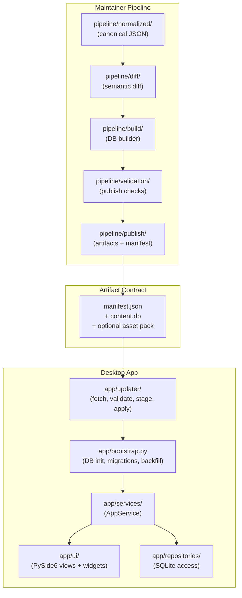

# MSM Awakening Tracker

A Windows desktop companion app for *My Singing Monsters* that helps players track egg requirements for Amber Vessels, sleeping Wublins, and sleeping Celestials. Built with Python and PySide6 (Qt).

> **Unofficial fan project — not affiliated with, endorsed by, or sponsored by Big Blue Bubble Inc.** See [Legal & Attribution](#legal--attribution) for trademark and licensing details.

---

## Quick Start (Development)

```powershell
# Create and activate a virtual environment
python -m venv .venv
.venv\Scripts\activate

# Install dependencies
pip install -r requirements.txt

# Seed the content database from normalized pipeline data (first time only)
python scripts/seed_content_db.py

# Import official BBB Fan Kit images (if Fan Kit is present in Monsters/)
python scripts/import_fankit_images.py

# Generate placeholder assets for any missing images
python scripts/generate_assets.py
python scripts/generate_icon.py

# Run the app
python main.py

# Run the full test suite
python -m pytest tests/
```

---

## BBB Fan Kit Images (optional)

The "Import official BBB Fan Kit images" step in Quick Start expects an unzipped Fan Kit at `Monsters/` in the project root. The Fan Kit is the set of official monster portraits and egg images distributed by Big Blue Bubble under their Fan Content Policy.

**To use Fan Kit imagery:**

1. Obtain the BBB Fan Kit from Big Blue Bubble's official channels.
2. Unzip it to the project root so the structure is:

   ```
   MSM_App/
     Monsters/
       Monster Portrait Squares/
         Zynth.png
         Mammott.png
         ...
       Monster Eggs/
         Noggin.png
         ...
   ```

3. Run `python scripts/import_fankit_images.py`. The script copies, resizes to 256×256, and updates `pipeline/normalized/*.json` metadata to mark the assets as `bbb_fan_kit` rather than `generated_placeholder`.

**Without the Fan Kit:** the app still runs. `python scripts/generate_assets.py` produces placeholder images for any missing slots so you get a working build with generated artwork.

The `Monsters/` directory is intentionally `.gitignore`d — Fan Kit assets are large binaries and are not redistributable under the Fan Content Policy. See [`pipeline/SOURCE_POLICY.md`](pipeline/SOURCE_POLICY.md) for the full image-licensing posture.

---

## Architecture Overview

The project has a hard boundary between maintainer-side content tooling and the desktop app. They communicate only through a published artifact contract.



The `pipeline/` package is **maintainer-only tooling** — it is never imported by the desktop app at runtime. The desktop app is a pure consumer of the artifacts the pipeline produces.

---

## Project Layout

### Top-Level

| Path | Purpose |
|------|---------|
| `main.py` | Application entry point |
| `requirements.txt` | Python dependencies |
| `msm_tracker.spec` | PyInstaller packaging spec |
| `app/` | Desktop application code |
| `pipeline/` | Maintainer content production pipeline |
| `resources/` | Bundled static assets (DB, images, audio) |
| `scripts/` | Build-time and dev-time utilities |
| `tests/` | pytest unit and integration tests |
| `RELEASE_CHECKLIST.md` | Release gate checklist |

### `app/` Subdirectories

| Path | Purpose |
|------|---------|
| `app/bootstrap.py` | Runtime path detection, DB init, migration runner, key backfill, service wiring |
| `app/domain/` | Pure domain logic: models, breed-list derivation, reconciliation |
| `app/commands/` | Command-pattern objects (add target, close-out, increment egg) for undo/redo |
| `app/services/` | Application service / presenter layer (`AppService`, audio player) |
| `app/repositories/` | SQLite data access (`monster_repo`, `target_repo`, `settings_repo`) |
| `app/ui/` | PySide6 widget layer — views, panels, widgets; no business logic |
| `app/ui/widgets/` | Reusable card and row widgets (`monster_card`, `egg_row_widget`, etc.) |
| `app/assets/` | Runtime asset path resolver (`resolver.py`) |
| `app/updater/` | Content update subsystem: fetch manifest, validate, download, stage, apply, rollback |
| `app/db/` | Connection factory and migration runner |
| `app/db/migrations/content/` | Schema migrations for `content.db` (`0001` initial, `0002` stable identity + provenance) |
| `app/db/migrations/userstate/` | Schema migrations for `userstate.db` (`0001` initial, `0002` stable keys) |

### `pipeline/` Subdirectories

| Path | Purpose |
|------|---------|
| `pipeline/normalized/` | Canonical JSON source files (`monsters.json`, `eggs.json`, `requirements.json`, `assets.json`, `aliases.json`, `deprecations.json`) |
| `pipeline/schemas/` | Normalized record schema definitions and validators (`normalized.py`) |
| `pipeline/raw/` | Raw source cache (`source_cache.py`) and normalization adapters (`normalizer.py`) |
| `pipeline/curation/` | Curator override parser (`overrides.py`, `overrides.yaml`) and review queue (`review_queue.py`) |
| `pipeline/review/` | Manual review queue JSON (`manual-review-queue.json`) |
| `pipeline/diff/` | Semantic diff engine (`engine.py`) — classifies new, changed, renamed, deprecated, and revived entities |
| `pipeline/build/` | Deterministic content DB builder (`db_builder.py`) with numeric ID preservation |
| `pipeline/validation/` | Publish-time validation checks (`checks.py`) |
| `pipeline/publish/` | Release artifact generators (`artifacts.py`): manifest, assets-manifest, diff-report, validation-report |
| `pipeline/export_baseline.py` | One-time script to export seed data into the normalized JSON files |

---

## Databases

### `content.db` (schema v2)

Read-only at desktop runtime. Written by `scripts/seed_content_db.py` and replaced atomically during content updates.

| Table | Purpose |
|-------|---------|
| `monsters` | Monster definitions — name, type, image path, deprecation, stable identity |
| `egg_types` | Egg type definitions — breed times, image path, deprecation, stable identity |
| `monster_requirements` | Egg quantities required per monster |
| `update_metadata` | Key-value store for `content_version`, `schema_version`, `last_updated_utc`, `artifact_contract_version`, etc. |
| `content_aliases` | Maps former content keys to current keys to support renames |
| `content_audit` | Append-only log of content changes for traceability |

**Schema v2 additions** (migration `0002`): every `monsters` and `egg_types` row carries:
- `content_key` — stable slug-based identifier (e.g. `monster:wublin:zynth`) that survives numeric ID reassignment across rebuilds
- `source_fingerprint`, `asset_source`, `asset_sha256` — provenance and asset integrity tracking
- `deprecated_at_utc`, `deprecation_reason` — soft deprecation fields (entities are never hard-deleted)

### `userstate.db` (schema v2)

Read-write. Lives in `%APPDATA%\MSMAwakeningTracker\` alongside `content.db`.

| Table | Purpose |
|-------|---------|
| `active_targets` | Monsters the user is currently working toward; includes `monster_key` (stable reference) |
| `target_requirement_progress` | Per-egg progress counters; includes `egg_key` (stable reference) |
| `app_settings` | Key-value user preferences including `last_reconciled_content_version` |

**Startup behavior**: on every launch, `bootstrap.py` runs pending migrations on both databases, then backfills any empty `content_key` / `monster_key` / `egg_key` values. This means upgrading from schema v1 to v2 is transparent to the user.

---

## Content Pipeline

The `pipeline/` package is a maintainer-side toolchain for producing and publishing content updates. It is never bundled with the desktop app.

### Data Flow

1. **Normalized source** — `pipeline/normalized/*.json` is the single source of truth for all game content. It is human-readable, diffable, and version-controlled.
2. **Curation** — `pipeline/curation/overrides.yaml` allows manual corrections. `pipeline/review/manual-review-queue.json` tracks items needing human resolution before publishing.
3. **Semantic diff** — `pipeline/diff/engine.py` compares a baseline set of normalized content against a candidate, classifying every change (`new`, `field_change`, `rename`, `deprecated`, `revived`, `requirements_change`, `placeholder_to_official`, etc.).
4. **DB build** — `pipeline/build/db_builder.py` builds a deterministic `content.db` from normalized data. It preserves numeric IDs for unchanged entities to avoid disrupting user state.
5. **Validation** — `pipeline/validation/checks.py` runs publish-time gates (schema integrity, orphan references, unique content keys, placeholder count, no blocking review items).
6. **Artifact generation** — `pipeline/publish/artifacts.py` produces `manifest.json`, `assets-manifest.json`, `diff-report.json`, and `validation-report.json`.

### Stable Identity (`content_key`)

Every monster and egg carries a `content_key` of the form `monster:<type>:<slug>` or `egg:<slug>` (e.g. `monster:wublin:zynth`, `egg:noggin`). This key is permanent and survives numeric ID changes across DB rebuilds, ensuring user progress references remain valid after any content update.

---

## Content Updates (Client Side)

The in-app "Check for Updates" feature in Settings downloads and applies a new `content.db`. The flow:

1. Fetch `manifest.json` from the manifest URL (see `app/updater/update_service.py` → `DEFAULT_MANIFEST_URL`).
2. Validate the manifest contract (`artifact_contract_version`, required fields, SHA-256 format).
3. If a newer `content_version` is present, prompt the user to apply.
4. Download the new `content.db`, verify its SHA-256 checksum against the manifest.
5. Validate the staged DB schema and referential integrity.
6. Atomically replace `content.db` in `%APPDATA%\MSMAwakeningTracker\`, reopen the connection, and reconcile user state.
7. On failure at any step, the prior `content.db` is restored from backup automatically.

> **Note**: The `DEFAULT_MANIFEST_URL` points to `https://raw.githubusercontent.com/zackmeach/MSM_App/main/content/manifest.json`. The `content/` directory is populated by the publish pipeline (`scripts/publish_content.py`). Until content artifacts are published there, the "Check for Updates" button will return a 404 — this is handled gracefully.

---

## Content Coverage

| Category | Count | Notes |
|----------|-------|-------|
| Wublins | 20 | All regular Wublins (including Monculus) |
| Celestials | 12 | All regular Celestials |
| Amber Vessels | 32 | All Amber Island vessels |
| Egg Types | 76 | All required breeding elements |

All 64 monsters and 76 egg types have official artwork from the BBB Fan Kit (portrait squares and egg images). Canonical data lives in `pipeline/normalized/`. The seeded `resources/db/content.db` is built from it by `scripts/seed_content_db.py`.

---

## Scripts

| Script | Purpose |
|--------|---------|
| `scripts/seed_content_db.py` | Builds `resources/db/content.db` from `pipeline/normalized/*.json`. Falls back to embedded Python literals if the normalized files are absent. |
| `scripts/import_fankit_images.py` | Imports official BBB Fan Kit images (portraits + eggs) from `Monsters/` into `resources/images/`. Resizes to 256×256, updates metadata. Skips existing files unless `--force`. |
| `scripts/generate_assets.py` | Generates placeholder PNG images for any missing egg/monster slots, plus the UI placeholder. Skips files that already exist so Fan Kit images are preserved. |
| `scripts/generate_icon.py` | Generates a placeholder `app_icon.ico`. Replace with official artwork before distribution. |
| `scripts/verify_bundle.py` | Validates the full bundle: DB integrity, image paths, row counts, no orphan requirements. Must exit 0 before a release is tagged. |
| `scripts/build.py` | Full release pipeline: run tests → seed DB → generate assets → generate icon → verify bundle → PyInstaller package. Output at `dist/MSMAwakeningTracker/`. |

---

## Testing

359 tests across unit and integration suites.

```powershell
python -m pytest tests/          # full suite
python -m pytest tests/unit/     # unit only
python -m pytest tests/ -v --tb=short  # verbose with short tracebacks
```

### Key Test Modules

| Module | Covers |
|--------|--------|
| `tests/unit/test_acceptance.py` | SRS acceptance criteria AC-R01 through AC-R06 |
| `tests/unit/test_commands.py` | Undo/redo commands (add, close-out, increment) |
| `tests/unit/test_breed_list.py` | Breed list derivation and FIFO egg allocation |
| `tests/unit/test_reconciliation.py` | User state reconciliation after content updates |
| `tests/unit/test_migrations.py` | Schema migrations and key backfill for both DBs |
| `tests/unit/test_updater.py` | Manifest contract validation, checksum, client compatibility |
| `tests/unit/test_update_finalization.py` | DB swap, rollback, WAL cleanup, rebind |
| `tests/unit/test_diff_builder.py` | Semantic diff engine and deterministic DB builder |
| `tests/unit/test_pipeline_schemas.py` | Normalized content schema validators |
| `tests/unit/test_pipeline_acquisition.py` | Source cache and normalization adapters |
| `tests/unit/test_artifacts_validation.py` | Publish-time artifact and validation checks |
| `tests/unit/test_verify_bundle.py` | Bundle verification script |
| `tests/unit/test_gui_smoke.py` | GUI smoke test (widget creation, no crash) |
| `tests/integration/test_repositories.py` | Repository layer against real in-memory SQLite |

See `RELEASE_CHECKLIST.md` for the full set of release gates that must pass before a build is tagged.

---

## Building a Release

```powershell
python scripts/build.py
```

Runs the full pipeline: tests, seed, asset generation, bundle verification, then PyInstaller packaging. The distributable is written to `dist/MSMAwakeningTracker/`.

> **Current gap**: no installer wrapper (Inno Setup / NSIS) exists yet. The packaged app runs from the `dist/` directory but is not wrapped in a single-file installer. See `RELEASE_CHECKLIST.md` section 4 for packaging gates.

---

## Tech Stack

| Component | Library / Tool |
|-----------|---------------|
| UI framework | PySide6 (Qt 6 for Python) |
| Database | SQLite via `sqlite3` (stdlib) |
| Packaging | PyInstaller 6+ |
| Testing | pytest, pytest-qt |
| Python | 3.10+ |

---

## Legal & Attribution

**Unofficial fan project — not affiliated with, endorsed by, or sponsored by Big Blue Bubble Inc.**

*My Singing Monsters*, *Wublin*, *Celestial*, *Amber Vessel*, the BBB Fan Kit, and all monster names, designs, and artwork are trademarks or copyrights of Big Blue Bubble Inc. This project uses factual game data (names, types, breeding requirements) and official BBB Fan Kit imagery in compliance with Big Blue Bubble's Fan Content Policy. All artwork remains the property of Big Blue Bubble.

### What the license covers

The [LICENSE](LICENSE) file (MIT) covers only the source code authored for this project. It does **not** grant rights to:

- Monster names, artwork, lore, or any other content owned by Big Blue Bubble Inc.
- BBB Fan Kit imagery imported into `resources/images/` via `scripts/import_fankit_images.py`
- Game data (egg requirements, breeding times) sourced from the *My Singing Monsters* Fandom Wiki

See [`pipeline/SOURCE_POLICY.md`](pipeline/SOURCE_POLICY.md) for the full content sourcing and licensing posture.

### Reporting concerns

If you represent Big Blue Bubble and have concerns about how this project uses BBB IP, please open a GitHub issue on the [project repository](https://github.com/zackmeach/MSM_App).
